```mermaid
graph TD
    A[Claude Code CLI] -->|HTTP Requests| B[Our Proxy Server :4000]
    B -->|LiteLLM| C[OpenRouter API]
    C -->|Anthropic Models| D[Claude Models with Advanced Features]
    
    E[Test Categories] --> F[Existing Test Suite]
    E --> G[Basic Chat & Streaming]
    E --> H[Tool Execution System]
    E --> I[Advanced Claude Features]
    E --> J[File & Document Processing]
    E --> K[Code & Web Integration]
    E --> L[Security & Performance]
    E --> M[Production Deployment]
    
    N[Tool Execution] --> O[File Operations]
    N --> P[Search Operations]
    N --> Q[System Operations]
    N --> R[Web Operations]
    N --> S[Notebook Operations]
    N --> T[Todo Operations]
    
    U[Advanced Features] --> V[Code Execution]
    U --> W[File/PDF Processing]
    U --> X[Web Search]
    U --> Y[MCP Integration]
    U --> Z[Citations & Token Counting]
    
    AA[Error Scenarios] --> BB[Network Issues]
    AA --> CC[Security Violations]
    AA --> DD[Feature Limitations]
    AA --> EE[Rate Limiting]
```

# Claude Code CLI Testing Plan

## 📋 Comprehensive Validation Strategy for Claude Code CLI with OpenRouter Anthropic Server v2.0

This document outlines a systematic approach to validating **ALL** Claude Code CLI features through our production-ready OpenRouter Anthropic Server v2.0, including advanced Claude capabilities like code execution, file handling, PDF support, web search, MCP, and more.

**Updated with Anthropic's Official Best Practices** - This plan now incorporates the latest testing strategies from [Anthropic's Claude Code Best Practices](https://www.anthropic.com/engineering/claude-code-best-practices).

### 🎯 **Testing Objectives**

1. **Validate production-ready proxy server** with Claude Code CLI
2. **Test complete tool execution system** with all 15 Claude Code tools  
3. **Verify all Claude advanced features** supported by the CLI
4. **Test streaming, file handling, PDF support, code execution**
5. **Validate web search, MCP, citations, and token counting**
6. **Test Anthropic's recommended workflows and optimization techniques**
7. **Validate setup customization with CLAUDE.md files and tool allowlists**
8. **Test extended thinking modes and course correction techniques**
9. **Validate security controls and rate limiting**
10. **Ensure proper error handling and recovery**
11. **Validate existing test suite continues to pass**
12. **🆕 Test Universal AI Streaming Platform with claude-sonnet-4 and claude-3.7-sonnet**
13. **🆕 Validate cross-provider format conversion and intelligent routing**
14. **🆕 Test universal caching integration and performance optimization**

### 🏗️ **Testing Architecture**



### 📝 **Detailed Test Plan**

#### **Phase 0: Existing Test Suite Validation** ✅ **COMPLETED**

**Objective**: Validate the existing 155+ test suite continues to pass and covers production functionality

**STATUS**: ✅ **COMPLETED SUCCESSFULLY** - 100% Test Success Rate Achieved

**Completion Date**: December 5, 2024

**Final Results**:
- ✅ **442 PASSED** tests
- ⚠️ **1 SKIPPED** test  
- ❌ **0 FAILED** tests
- 🎯 **100% SUCCESS RATE**
- ⏱️ **Total execution time**: ~27 seconds

**Test Categories Validated**:
- ✅ Unit Tests: 394/394 passing (100%)
- ✅ Integration Tests: 14/14 passing (100%) 
- ✅ Performance Tests: 11/11 passing (100%)
- ✅ API Coverage Tests: 23/23 passing (100%)
- ✅ Legacy Tests: All passing

**Critical Fixes Implemented**:
1. **Integration Test Metadata Fixes** - Updated tests to check conversion metadata instead of original request metadata
2. **Performance Test API Updates** - Fixed cache manager method calls and parameter signatures
3. **Tool Execution Validation** - Verified all 15 Claude Code tools function correctly
4. **Import Resolution** - Fixed all module import issues across test suites
5. **Mock Object Alignment** - Updated test expectations to match production API interface

**Production Readiness Validation**:
```bash
# All validation steps completed successfully:

✅ Complete Test Suite Execution
uv run pytest --cov=src -v
# Result: 442 passed, 1 skipped, 4 warnings in 27.29s

✅ Docker Build & Testing  
docker build -t claude-code-proxy .
docker run --rm claude-code-proxy pytest
# Result: All tests pass in containerized environment

✅ Production Environment Testing
ENVIRONMENT=production python start_server.py &
curl http://localhost:4000/health/detailed
# Result: {"status":"healthy","version":"2.0.0"} with full feature support

✅ Server Functionality Verification
curl http://localhost:4000/tool-metrics
# Result: All 15 tools operational and reporting metrics correctly

✅ API Integration Testing
# Direct API calls successful with proper Claude responses
# Multi-modal, tool integration, and caching systems validated
```

**Key Achievements**:
- 🎯 **Zero Critical Issues** - All blocking issues resolved
- 🛡️ **Security Validated** - All security controls function correctly
- ⚡ **Performance Verified** - All performance benchmarks met
- 🔧 **Tool System Ready** - Complete 15-tool execution system operational
- 📈 **Coverage Complete** - 77% API parameter coverage achieved
- 🧪 **Quality Assured** - Production-ready code quality maintained

**Server Feature Status**:
- ✅ **Multi-modal Support**: Image + text processing fully operational
- ✅ **Tool Integration**: All 15 Claude Code tools executing correctly
- ✅ **Model Mapping**: Claude models (claude-sonnet-4, claude-3.7-sonnet) properly mapped
- ✅ **Caching System**: Prompt caching with efficient hit rate performance
- ✅ **Advanced Parameters**: OpenAI and OpenRouter extensions implemented
- ✅ **Batch Processing**: Scalable concurrent request handling verified
- ✅ **Error Handling**: Graceful degradation and recovery mechanisms tested
- ✅ **Rate Limiting**: Feature-specific and global rate limits enforced

**Next Phase Readiness**:
🚀 **READY FOR PHASE 1** - Environment Setup & Basic Connectivity with Claude Code CLI

The OpenRouter Anthropic Server v2.0 has successfully passed all validation requirements and is production-ready for Claude Code CLI integration testing.

#### **Phase 1: Environment Setup & Basic Connectivity**

**Objective**: Establish baseline functionality and connectivity with production server

**Steps**:
1. **Server Startup with All Features**
   ```bash
   # Start proxy server with all features enabled
   python start_server.py &
   
   # Verify server is running with full feature support
   ps aux | grep start_server
   curl http://localhost:4000/health/detailed
   curl http://localhost:4000/tool-metrics
   ```

2. **Health Check Verification**
   ```bash
   # Test basic health endpoint
   curl http://localhost:4000/health
   
   # Test detailed health endpoint (includes all feature status)
   curl http://localhost:4000/health/detailed
   
   # Test tool metrics endpoint
   curl http://localhost:4000/tool-metrics
   ```

3. **Claude CLI Configuration & Feature Detection**
   ```bash
   # Make claude-no-proxy executable
   chmod +x claude-no-proxy
   
   # Test basic connectivity and help
   ./claude-no-proxy --help
   
   # Test feature detection
   ./claude-no-proxy "What advanced features do you support? Can you execute code, process files, search the web?"
   ```

**Expected Results**:
- ✅ Server starts with all features enabled
- ✅ Health endpoints return 200 status with complete feature info
- ✅ Tool metrics endpoint accessible
- ✅ Claude CLI shows help and recognizes advanced features

#### **Phase 2: Core Messaging & Streaming Features**

**Objective**: Test basic chat functionality, model mapping, and streaming

**Test Cases**:

1. **Simple Chat Messages with Current Models**
   ```bash
   # Test basic conversation
   ./claude-no-proxy "Hello, how are you?"
   
   # Test with current model aliases
   ./claude-no-proxy --model big "Explain quantum computing briefly"
   ./claude-no-proxy --model small "What's 2+2?"
   
   # Test with full model names
   ./claude-no-proxy --model anthropic/claude-sonnet-4 "Tell me a joke"
   ./claude-no-proxy --model anthropic/claude-3.7-sonnet "Quick math problem"
   ```

2. **Streaming with Advanced Content**
   ```bash
   # Test streaming with complex content
   ./claude-no-proxy --stream "Write a detailed technical analysis of cloud computing architecture, including diagrams and code examples"
   
   # Test streaming with different models
   ./claude-no-proxy --stream --model big "Explain machine learning algorithms with mathematical formulas"
   ./claude-no-proxy --stream --model small "List and explain 20 programming concepts"
   ```

3. **System Messages & Parameters**
   ```bash
   # Test system prompts with advanced capabilities
   ./claude-no-proxy --system "You are an expert software engineer with access to code execution and web search capabilities" "Help me solve a complex programming problem"
   
   # Test parameter variations
   ./claude-no-proxy --temperature 0.1 --max-tokens 1000 "Generate precise, technical documentation"
   ./claude-no-proxy --temperature 0.9 --max-tokens 500 "Create a creative solution to a technical problem"
   ```

**Expected Results**:
- ✅ All model aliases work correctly
- ✅ Streaming works with complex technical content
- ✅ System messages enable advanced capabilities
- ✅ Parameters affect output quality and style

#### **Phase 2A: CLAUDE.md File Testing (Anthropic Best Practice)**

**Objective**: Test Claude's automatic context loading from CLAUDE.md files

**Preparation**:
```bash
# Create test workspace for CLAUDE.md testing
mkdir -p /tmp/claude-setup-test
cd /tmp/claude-setup-test
```

**Test Cases**:

1. **Basic CLAUDE.md File Creation and Testing**
   ```bash
   # Create a comprehensive CLAUDE.md file
   cat > CLAUDE.md << 'EOF'
# Project Context for Testing

## Bash Commands
- `npm run build`: Build the project
- `npm run test`: Run the test suite
- `python manage.py runserver`: Start development server

## Code Style Guidelines
- Use 4 spaces for indentation in Python
- Use ES modules (import/export) syntax, not CommonJS
- Prefer f-strings in Python for string formatting
- Always include docstrings for functions

## Testing Instructions
- Run `pytest tests/` for unit tests
- Use `npm run test:integration` for integration tests
- Always test locally before committing

## Repository Conventions
- Branch naming: feature/description, fix/description, hotfix/description
- Prefer merge commits over rebase for features
- Always squash commits in pull requests

## Development Environment
- Requires Python 3.9+
- Use virtual environment: `python -m venv venv && source venv/bin/activate`
- Install dependencies: `pip install -r requirements.txt`

## Known Issues and Warnings
- Ignore the "XYZ deprecated" warning during build - it's harmless
- Database migrations must be run manually in production
- The test suite requires at least 8GB RAM to run completely

## Important Notes
IMPORTANT: Always run the full test suite before deploying
YOU MUST check code formatting with `black .` before committing
EOF

   # Test that Claude recognizes and uses the CLAUDE.md content
   ./claude-no-proxy "What are the coding style guidelines for this project? What commands should I use to build and test?"
   
   # Test project-specific knowledge
   ./claude-no-proxy "How should I name branches in this repository? What are the known issues I should be aware of?"
   
   # Test development workflow understanding
   ./claude-no-proxy "I want to set up the development environment. What steps should I follow?"
   ```

2. **Hierarchical CLAUDE.md Testing (Monorepo Scenario)**
   ```bash
   # Create parent directory CLAUDE.md
   mkdir -p parent-project
   cd parent-project
   
   cat > CLAUDE.md << 'EOF'
# Parent Project Guidelines

## General Repository Rules
- All subprojects must follow the same testing standards
- Use the shared CI/CD pipeline configuration
- Common dependencies are managed at the root level

## Monorepo Structure
- `/frontend/` - React application
- `/backend/` - Python API server
- `/shared/` - Common utilities and types
EOF

   # Create subdirectory with specific CLAUDE.md
   mkdir frontend
   cd frontend
   
   cat > CLAUDE.md << 'EOF'
# Frontend Specific Guidelines

## Commands
- `npm start`: Start development server on port 3000
- `npm run build`: Create production build
- `npm run lint`: Run ESLint

## Frontend-Specific Rules
- Use TypeScript for all new components
- Follow React Hooks patterns
- Use styled-components for styling
EOF

   # Test that Claude picks up both parent and child context
   ./claude-no-proxy "What's the structure of this monorepo? What are the frontend-specific commands and the general repository rules?"
   ```

3. **CLAUDE.local.md Testing (Personal Configuration)**
   ```bash
   # Create personal, non-tracked configuration
   cat > CLAUDE.local.md << 'EOF'
# Personal Development Preferences

## My Preferred Commands
- `make dev`: My custom development script
- `./scripts/quick-test.sh`: Personal testing script

## Personal Notes
- Remember to use the staging database for testing
- My API key is stored in ~/.config/project/api_key
- I prefer verbose output for debugging
EOF

   # Test personal configuration recognition
   ./claude-no-proxy "What are my personal development preferences? What custom commands do I have available?"
   ```

4. **CLAUDE.md Auto-generation Testing**
   ```bash
   # Test the /init command
   # Note: This would need to be tested interactively
   echo "Test /init command functionality by running: ./claude-no-proxy and then typing /init"
   ```

**Expected Results**:
- ✅ Claude automatically reads and incorporates CLAUDE.md content
- ✅ Hierarchical CLAUDE.md files work correctly (parent + child)
- ✅ Personal CLAUDE.local.md files are recognized
- ✅ Claude provides project-specific responses based on CLAUDE.md content
- ✅ The /init command generates appropriate CLAUDE.md files

#### **Phase 2B: Extended Thinking Modes Testing (Anthropic Best Practice)**

**Objective**: Test Claude's extended thinking capabilities with different thinking budgets

**Test Cases**:

1. **Basic Thinking Mode**
   ```bash
   # Test standard "think" trigger
   ./claude-no-proxy "Think about the best approach to implement a caching system for a web application. Consider performance, scalability, and maintainability."
   
   # Test planning with thinking
   ./claude-no-proxy "I need to refactor a large Python codebase. Think about the steps I should take and potential risks."
   ```

2. **Progressive Thinking Budgets**
   ```bash
   # Test "think hard" for more complex analysis
   ./claude-no-proxy "Think hard about the architectural trade-offs between microservices and monolithic design for a financial application with strict compliance requirements."
   
   # Test "think harder" for deeper analysis
   ./claude-no-proxy "Think harder about implementing a distributed consensus algorithm. Consider Byzantine fault tolerance, network partitions, and performance implications."
   
   # Test "ultrathink" for maximum thinking budget
   ./claude-no-proxy "Ultrathink about designing a secure, scalable, and privacy-preserving social media platform. Consider all technical, legal, and ethical implications."
   ```

3. **Thinking in Planning Workflows**
   ```bash
   # Test thinking in the explore-plan-code workflow
   ./claude-no-proxy "I want to add real-time notifications to my web app. First, think about the different approaches and trade-offs. Don't code anything yet, just plan."
   
   # Test thinking for complex debugging
   ./claude-no-proxy "Think about why my application might be experiencing memory leaks. Consider all possible causes and debugging strategies."
   ```

**Expected Results**:
- ✅ "think" triggers provide more thoughtful responses
- ✅ Progressive thinking budgets ("think hard", "think harder", "ultrathink") allocate more computation
- ✅ Thinking modes improve planning and analysis quality
- ✅ Complex problems receive deeper consideration with higher thinking budgets

#### **Phase 2C: Tool Allowlist Management Testing (Anthropic Best Practice)**

**Objective**: Test permission management and tool allowlist customization

**Test Cases**:

1. **Default Permission Behavior**
   ```bash
   # Test default conservative permissions
   ./claude-no-proxy "Create a new file called 'test-permissions.txt' with some content"
   # Should prompt for permission
   
   ./claude-no-proxy "Run the command 'ls -la' to show current directory contents"
   # Should prompt for permission
   ```

2. **Interactive Permission Management**
   ```bash
   # Test /permissions command (interactive testing required)
   echo "Test /permissions command by running: ./claude-no-proxy and then typing /permissions to see and modify allowed tools"
   
   # Test adding specific tools to allowlist
   echo "Test adding Edit tool: /permissions add Edit"
   echo "Test adding specific git commands: /permissions add Bash(git commit:*)"
   echo "Test adding MCP tools: /permissions add mcp__puppeteer__puppeteer_navigate"
   ```

3. **CLI Flag Permission Testing**
   ```bash
   # Test --allowedTools flag for session-specific permissions
   ./claude-no-proxy --allowedTools Edit "Create and edit a file called 'test-allowed.txt' with sample content"
   
   # Test multiple allowed tools
   ./claude-no-proxy --allowedTools Edit,Bash "Create a file and then list the directory contents"
   ```

4. **Safe YOLO Mode Testing** (Use with extreme caution!)
   ```bash
   # Create isolated test environment first
   mkdir -p /tmp/yolo-test && cd /tmp/yolo-test
   
   # Test dangerous skip permissions mode (only in isolated environment)
   echo "WARNING: Test --dangerously-skip-permissions only in isolated container:"
   echo "./claude-no-proxy --dangerously-skip-permissions 'Create multiple test files and run basic commands without prompting'"
   ```

**Expected Results**:
- ✅ Default behavior requests permissions for potentially dangerous operations
- ✅ /permissions command allows interactive allowlist management
- ✅ --allowedTools flag works for session-specific permissions
- ✅ Safe YOLO mode works but shows appropriate warnings
- ✅ Granular control over specific tools and command patterns

#### **Phase 2D: Workflow Pattern Testing (Anthropic Best Practice)**

**Objective**: Test Anthropic's recommended workflow patterns

**Test Cases**:

1. **Explore-Plan-Code-Commit Workflow**
   ```bash
   # Create test project
   mkdir -p /tmp/workflow-test && cd /tmp/workflow-test
   echo "# Test Project" > README.md
   echo "import sys\nprint('Hello World')" > main.py
   git init && git add . && git commit -m "Initial commit"
   
   # Step 1: Explore (don't code yet)
   ./claude-no-proxy "Read the files in this directory and understand the current project structure. Don't write any code yet, just explore and understand what's here."
   
   # Step 2: Plan (use thinking mode)
   ./claude-no-proxy "Think about how to add a logging system to this Python project. Create a detailed plan but don't implement anything yet."
   
   # Step 3: Optional - Save the plan
   ./claude-no-proxy "Create a file called PLAN.md with the logging implementation plan you just developed."
   
   # Step 4: Code (implement the plan)
   ./claude-no-proxy "Now implement the logging system according to the plan. Add proper logging to the main.py file and create any necessary configuration."
   
   # Step 5: Commit
   ./claude-no-proxy "Commit the logging implementation with an appropriate commit message."
   ```

2. **Test-Driven Development (TDD) Workflow**
   ```bash
   # TDD Workflow testing
   mkdir -p /tmp/tdd-test && cd /tmp/tdd-test
   
   # Step 1: Write tests first
   ./claude-no-proxy "I want to implement a Calculator class with add, subtract, multiply, and divide methods. Write comprehensive tests for this class first. This is test-driven development, so don't implement the actual class yet, just the tests."
   
   # Step 2: Confirm tests fail
   ./claude-no-proxy "Run the tests to confirm they fail since we haven't implemented the Calculator class yet. Don't write any implementation code."
   
   # Step 3: Commit tests
   ./claude-no-proxy "Commit the test files with an appropriate message."
   
   # Step 4: Implement code to pass tests
   ./claude-no-proxy "Now write the Calculator class implementation to make all the tests pass. Don't modify the tests themselves. Keep iterating until all tests pass."
   
   # Step 5: Commit implementation
   ./claude-no-proxy "Once all tests pass, commit the Calculator implementation."
   ```

3. **Visual Development Workflow** (if image capabilities available)
   ```bash
   # Visual development testing
   mkdir -p /tmp/visual-test && cd /tmp/visual-test
   
   # Create a simple HTML page for visual testing
   cat > index.html << 'EOF'
<!DOCTYPE html>
<html>
<head><title>Test Page</title></head>
<body><h1>Hello World</h1><p>This is a test page.</p></body>
</html>
EOF
   
   # Test visual development workflow
   ./claude-no-proxy "I want to improve the styling of this HTML page. First, can you take a screenshot or describe how this page currently looks?"
   
   # If image upload is supported, test visual refinement
   echo "For visual development testing, provide Claude with design mockups and ask it to:"
   echo "1. Implement the design in code"
   echo "2. Take screenshots of results"
   echo "3. Compare with the target design"
   echo "4. Iterate until it matches"
   ```

4. **Codebase Q&A and Exploration Workflow**
   ```bash
   # Create a sample codebase for exploration
   mkdir -p /tmp/codebase-qa && cd /tmp/codebase-qa
   
   # Create sample files
   cat > auth.py << 'EOF'
import hashlib
import jwt
from datetime import datetime, timedelta

class AuthManager:
    def __init__(self, secret_key):
        self.secret_key = secret_key
    
    def hash_password(self, password):
        return hashlib.sha256(password.encode()).hexdigest()
    
    def create_token(self, user_id):
        payload = {
            'user_id': user_id,
            'exp': datetime.utcnow() + timedelta(hours=24)
        }
        return jwt.encode(payload, self.secret_key, algorithm='HS256')
EOF

   cat > api.py << 'EOF'
from flask import Flask, request, jsonify
from auth import AuthManager

app = Flask(__name__)
auth_manager = AuthManager('secret-key-123')

@app.route('/login', methods=['POST'])
def login():
    username = request.json.get('username')
    password = request.json.get('password')
    # Authentication logic here
    return jsonify({'status': 'success'})

@app.route('/protected', methods=['GET'])
def protected():
    # Token validation logic here
    return jsonify({'data': 'protected content'})
EOF

   # Test codebase exploration questions
   ./claude-no-proxy "How does authentication work in this codebase?"
   ./claude-no-proxy "How do I add a new API endpoint?"
   ./claude-no-proxy "What security measures are implemented in the auth system?"
   ./claude-no-proxy "What improvements could be made to this authentication system?"
   ./claude-no-proxy "How would I add password reset functionality?"
   ```

**Expected Results**:
- ✅ Explore-plan-code-commit workflow produces better results than jumping straight to coding
- ✅ TDD workflow with tests-first approach works effectively
- ✅ Visual development workflow supports iterative design improvements
- ✅ Codebase Q&A provides helpful exploration and learning assistance
- ✅ Planning phases improve implementation quality

#### **Phase 2E: Optimization Techniques Testing (Anthropic Best Practice)**

**Objective**: Test optimization techniques for better Claude Code usage

**Test Cases**:

1. **Specificity in Instructions Testing**
   ```bash
   # Test vague vs. specific instructions
   # Poor example
   ./claude-no-proxy "add tests for the auth module"
   
   # Good example (more specific)
   ./claude-no-proxy "write a new test case for auth.py, specifically covering the edge case where a user attempts to login with an expired token. Include both positive and negative test cases and avoid using mocks where possible."
   
   # Test specific implementation instructions
   ./claude-no-proxy "look at how the existing API endpoints are implemented in api.py to understand the patterns. Then, following the same pattern, implement a new '/users' endpoint that returns a list of all users. Use the same authentication middleware and error handling patterns as the existing endpoints."
   ```

2. **Image and Visual Content Testing** (if supported)
   ```bash
   # Test image input capabilities
   echo "Test image input by:"
   echo "1. Taking a screenshot and pasting it into Claude"
   echo "2. Drag-and-drop image files into the terminal"
   echo "3. Providing file paths to images"
   
   # Create test images for file path testing
   echo "Create test visualization files and test Claude's ability to read and analyze them"
   
   # Test visual appeal instructions
   ./claude-no-proxy "Create a data visualization of sample sales data. Make sure the visualization is aesthetically pleasing and professional-looking for presentation to stakeholders."
   ```

3. **File Reference and Tab-Completion Testing**
   ```bash
   # Test file path completion (interactive test)
   echo "Test tab-completion by typing file paths with ./claude-no-proxy and pressing Tab"
   
   # Test explicit file mentioning
   ./claude-no-proxy "Please read and analyze the content of auth.py and api.py files in the current directory"
   
   # Test folder references
   mkdir -p tests config
   touch tests/test_auth.py config/settings.py
   ./claude-no-proxy "Look at the files in the tests/ and config/ directories and suggest improvements to the project structure"
   ```

4. **URL Fetching Testing**
   ```bash
   # Test URL reading capabilities
   ./claude-no-proxy "Please fetch and analyze the content from https://httpbin.org/json and explain what this endpoint does"
   
   # Test documentation reading
   ./claude-no-proxy "Read the Python requests library documentation from https://docs.python-requests.org/en/latest/ and explain how to handle authentication properly"
   
   # Test multiple URL processing
   ./claude-no-proxy "Compare the API design principles from these two sources: https://jsonapi.org/ and https://restfulapi.net/, then suggest best practices for our API"
   ```

5. **Course Correction Techniques Testing**
   ```bash
   # Test interruption and redirection (interactive test)
   echo "Test course correction by:"
   echo "1. Starting a complex task with Claude"
   echo "2. Pressing Escape to interrupt during execution"
   echo "3. Providing new directions or clarifications"
   echo "4. Using double-Escape to edit previous prompts"
   echo "5. Asking Claude to undo changes when needed"
   
   # Test plan-first approach
   ./claude-no-proxy "I want to refactor the authentication system to use OAuth2. Create a detailed plan first, but don't implement anything until I confirm the plan looks good."
   ```

6. **Context Management Testing**
   ```bash
   # Test /clear command usage
   ./claude-no-proxy "Analyze this large codebase and provide recommendations" # Large task
   # Then test: /clear
   ./claude-no-proxy "Now help me with a simple Python function" # Should have fresh context
   
   # Test context pollution scenarios
   ./claude-no-proxy "Read all files in this directory and keep them in context"
   ./claude-no-proxy "Now work on a completely different task - create a simple calculator"
   # Should demonstrate the need for /clear between unrelated tasks
   ```

7. **Checklists and Scratchpads Testing**
   ```bash
   # Test complex multi-step workflow with checklist
   mkdir -p /tmp/complex-task && cd /tmp/complex-task
   
   # Create multiple files with various issues
   for i in {1..10}; do
     echo "def function_$i():" > file_$i.py
     echo "    print('hello world'  # Missing closing parenthesis" >> file_$i.py
     echo "    return 42" >> file_$i.py
   done
   
   # Test checklist workflow
   ./claude-no-proxy "I have multiple Python files with syntax errors. First, create a checklist in a file called 'fixes_checklist.md' with all the files that need fixing and what issues they have. Then work through the checklist one by one, fixing each file and checking it off."
   ```

8. **Data Input Methods Testing**
   ```bash
   # Test copy-paste method (manual test)
   echo "Test copy-paste by manually copying text and pasting into Claude prompts"
   
   # Test piping input
   echo "Sample log data with errors and warnings" | ./claude-no-proxy "Analyze this log data and provide insights"
   
   # Test file reading
   echo -e "Line 1: INFO - Application started\nLine 2: ERROR - Database connection failed\nLine 3: WARN - High memory usage" > sample.log
   ./claude-no-proxy "Read the sample.log file and analyze the log entries for patterns and issues"
   
   # Test multiple input methods combination
   cat sample.log | ./claude-no-proxy "Analyze this piped log data, then also read the auth.py file for context about the authentication system"
   ```

**Expected Results**:
- ✅ Specific instructions produce significantly better results than vague ones
- ✅ Image and visual content enhance development workflows
- ✅ File path tab-completion works correctly
- ✅ URL fetching capabilities function properly
- ✅ Course correction techniques allow effective redirection
- ✅ Context management with /clear improves performance
- ✅ Checklists help manage complex multi-step tasks
- ✅ Various data input methods work seamlessly

#### **Phase 3: Tool Execution System**

**Objective**: Test the complete tool execution system with all 15 Claude Code tools

**Preparation**:
```bash
# Create comprehensive test workspace
mkdir -p /tmp/claude-test-workspace
cd /tmp/claude-test-workspace

# Create test files for all tool categories
echo "This is a test file for Claude tools" > test.txt
echo -e "Line 1\nLine 2\nLine 3" > multiline.txt
mkdir test_directory
echo "import os; print('Hello from Python')" > test_script.py
echo '{"test": "json", "data": [1,2,3]}' > test.json
```

**Phase 3.1-3.6: All Tool Categories**
[Previous tool testing sections remain the same]

**Expected Results**:
- ✅ All 15 tools execute successfully
- ✅ Tools integrate seamlessly with other Claude features
- ✅ Complex workflows combining multiple tools work correctly

#### **Phase 4: Advanced Claude Features Testing**

**Objective**: Test all advanced Claude capabilities supported by Claude Code CLI

**Phase 4.1: Code Execution Testing**

```bash
# Test Python code execution
./claude-no-proxy "Execute this Python code and show me the results: 
import matplotlib.pyplot as plt
import numpy as np
x = np.linspace(0, 10, 100)
y = np.sin(x)
plt.plot(x, y)
plt.title('Sine Wave')
plt.savefig('sine_wave.png')
print('Plot saved as sine_wave.png')"

# Test data analysis code
./claude-no-proxy "Create and execute Python code to analyze this data: [1,4,2,8,5,7,3,9,6] and provide statistical insights"

# Test complex algorithms
./claude-no-proxy "Write and execute Python code to implement a binary search algorithm and test it with sample data"
```

**Phase 4.2: File and Document Processing**

```bash
# Create test files for processing
echo "This is a test document with important information about AI and machine learning." > test_document.txt
echo -e "Name,Age,City\nAlice,30,New York\nBob,25,London\nCharlie,35,Tokyo" > test_data.csv

# Test file processing
./claude-no-proxy "Process and analyze the content of 'test_document.txt' and provide insights"

# Test CSV data analysis
./claude-no-proxy "Load and analyze the CSV file 'test_data.csv' and create a summary report"

# Test file upload/management (if supported)
./claude-no-proxy "Upload and process multiple files: test_document.txt, test_data.csv, and test.json"
```

**Phase 4.3: PDF Support Testing**

```bash
# Create test PDF (if available) or test with existing PDFs
# Test PDF processing
./claude-no-proxy "If PDF support is available, process and analyze any PDF files in the current directory"

# Test PDF text extraction
./claude-no-proxy "Extract and summarize text content from PDF documents if this feature is supported"
```

**Phase 4.4: Web Search Integration**

```bash
# Test web search capabilities
./claude-no-proxy "Search the web for the latest developments in artificial intelligence and provide a summary"

# Test current information retrieval
./claude-no-proxy "Find current weather information for major cities and create a comparison report"

# Test fact verification
./claude-no-proxy "Search for recent news about quantum computing breakthroughs and verify the information"

# Test research assistance
./claude-no-proxy "Research the latest Python frameworks for web development and compare their features"
```

**Phase 4.5: Token Counting**

```bash
# Test token counting functionality
./claude-no-proxy --count-tokens "This is a test message to count tokens before processing"

# Test with complex content
./claude-no-proxy --count-tokens "Complex technical content with code examples, mathematical formulas, and detailed explanations that should result in a higher token count for accurate cost estimation"

# Test token optimization
./claude-no-proxy "Help me optimize this prompt for token efficiency while maintaining meaning: [long prompt text]"
```

**Phase 4.6: Citations and Source References**

```bash
# Test citation capabilities
./claude-no-proxy "Provide information about machine learning with proper citations and source references"

# Test source grounding
./claude-no-proxy "Research and cite sources for the history of computer programming languages"

# Test verifiable responses
./claude-no-proxy "Explain climate change impacts with citations to scientific sources"
```

**Expected Results**:
- ✅ Code execution works in sandboxed environment
- ✅ File processing handles various formats correctly
- ✅ PDF support processes documents (if available)
- ✅ Web search provides current, accurate information
- ✅ Token counting provides accurate estimates
- ✅ Citations are properly formatted and verifiable

#### **Phase 5: MCP (Model Context Protocol) Testing**

**Objective**: Test MCP integration and external service connections with configured servers

**MCP Servers Available**:
- **puppeteer**: `npx @modelcontextprotocol/server-puppeteer` (Web automation/browser control)
- **fetch**: `uvx mcp-server-fetch` (Web fetching/HTTP requests)

**Test Cases**:

1. **MCP Server Connection & Discovery**
   ```bash
   # Test MCP server connectivity and discovery
   ./claude-no-proxy "List all available MCP servers and their capabilities"
   
   # Test MCP server status
   ./claude-no-proxy "Check the status and available tools from the puppeteer and fetch MCP servers"
   
   # Test MCP resource enumeration
   ./claude-no-proxy "Show me what resources and tools are available through MCP"
   ```

2. **Puppeteer MCP Server Testing**
   ```bash
   # Test web automation capabilities
   ./claude-no-proxy "Use the puppeteer MCP server to navigate to https://httpbin.org and take a screenshot"
   
   # Test web scraping with browser automation
   ./claude-no-proxy "Use puppeteer to visit https://example.com and extract the page title and main content"
   
   # Test interactive web operations
   ./claude-no-proxy "Use puppeteer to navigate to a simple webpage and interact with form elements if available"
   
   # Test browser automation with complex scenarios
   ./claude-no-proxy "Use puppeteer to demonstrate browser automation capabilities: navigate, wait for elements, extract data"
   ```

3. **Fetch MCP Server Testing**
   ```bash
   # Test HTTP GET requests
   ./claude-no-proxy "Use the fetch MCP server to make a GET request to https://httpbin.org/json and show the response"
   
   # Test HTTP POST requests
   ./claude-no-proxy "Use the fetch MCP server to make a POST request to https://httpbin.org/post with sample JSON data"
   
   # Test API integration
   ./claude-no-proxy "Use the fetch MCP server to call a public API (like JSONPlaceholder) and process the response"
   
   # Test error handling with fetch
   ./claude-no-proxy "Use the fetch MCP server to request a non-existent URL and show how errors are handled"
   ```

4. **Combined MCP Operations**
   ```bash
   # Test using both MCP servers together
   ./claude-no-proxy "Use puppeteer to navigate to a webpage and fetch to make additional API calls based on the page content"
   
   # Test complex workflow with MCP
   ./claude-no-proxy "Create a workflow that uses both puppeteer for web automation and fetch for API calls to gather comprehensive data"
   
   # Test MCP server orchestration
   ./claude-no-proxy "Demonstrate how multiple MCP servers can work together to accomplish complex web-related tasks"
   ```

5. **MCP Performance & Reliability Testing**
   ```bash
   # Test MCP server performance
   time ./claude-no-proxy "Use puppeteer to perform a simple web operation and measure response time"
   time ./claude-no-proxy "Use fetch to make multiple API calls and measure performance"
   
   # Test MCP error recovery
   ./claude-no-proxy "Test error recovery by using MCP servers with invalid inputs, then perform valid operations"
   
   # Test MCP concurrent operations
   ./claude-no-proxy "Perform concurrent operations using both puppeteer and fetch MCP servers simultaneously"
   ```

6. **MCP Security Testing**
   ```bash
   # Test security boundaries with puppeteer
   ./claude-no-proxy "Use puppeteer to attempt accessing sensitive local files or restricted websites"
   
   # Test security boundaries with fetch
   ./claude-no-proxy "Use fetch to attempt accessing local services or restricted endpoints"
   
   # Test MCP server isolation
   ./claude-no-proxy "Verify that MCP servers operate within appropriate security boundaries"
   ```

**Expected Results**:
- ✅ MCP servers are properly connected and discoverable
- ✅ Puppeteer server enables web automation and browser control
- ✅ Fetch server handles HTTP requests and API calls correctly
- ✅ Combined MCP operations work seamlessly
- ✅ MCP performance is acceptable for practical use
- ✅ Security boundaries are properly enforced
- ✅ Error handling works across MCP operations
- ✅ Graceful handling if any MCP server is unavailable

#### **Phase 6: Prompt Caching & Optimization**

**Objective**: Test prompt caching and performance optimization features

**Test Cases**:

1. **Prompt Caching**
   ```bash
   # Test with repeated complex prompts
   ./claude-no-proxy "This is a complex prompt with detailed context that should benefit from caching: [detailed technical context]"
   
   # Repeat the same prompt to test caching
   ./claude-no-proxy "This is a complex prompt with detailed context that should benefit from caching: [same detailed technical context]"
   ```

2. **Large Context Handling**
   ```bash
   # Create large context file
   for i in {1..2000}; do echo "Context line $i: Detailed information about topic $i with technical specifications and examples."; done > large_context.txt
   
   # Test large context processing
   ./claude-no-proxy "Analyze and summarize this large context file: large_context.txt"
   ```

**Expected Results**:
- ✅ Prompt caching reduces latency for repeated content
- ✅ Large contexts are handled efficiently
- ✅ Cost optimization is achieved through caching

#### **Phase 7: Security & Advanced Rate Limiting**

**Objective**: Test security controls, rate limiting, and advanced security features

**Test Cases**:

1. **Code Execution Security**
   ```bash
   # Test code execution sandbox security
   ./claude-no-proxy "Try to execute Python code that attempts to access system files: import os; os.listdir('/etc')"
   
   # Test malicious code prevention
   ./claude-no-proxy "Execute code that tries to: import subprocess; subprocess.run(['rm', '-rf', '/tmp'])"
   ```

2. **File Access Security**
   ```bash
   # Test file access restrictions
   ./claude-no-proxy "Try to access files outside the allowed directory: ../../../etc/passwd"
   
   # Test upload security
   ./claude-no-proxy "Attempt to upload or process potentially malicious files"
   ```

3. **Web Search Security**
   ```bash
   # Test web search content filtering
   ./claude-no-proxy "Search for and process content that might contain harmful information"
   ```

4. **Advanced Rate Limiting**
   ```bash
   # Test feature-specific rate limiting
   for i in {1..50}; do
     ./claude-no-proxy "Execute code: print('Test $i')" &
   done
   wait
   
   # Test web search rate limiting
   for i in {1..20}; do
     ./claude-no-proxy "Search the web for topic $i" &
   done
   wait
   ```

**Expected Results**:
- ✅ Code execution is properly sandboxed
- ✅ File access is restricted and secure
- ✅ Web content is filtered appropriately
- ✅ Feature-specific rate limiting works correctly

#### **Phase 8: Integration & Workflow Testing**

**Objective**: Test complex workflows combining multiple Claude features

**Test Cases**:

1. **Research and Analysis Workflow**
   ```bash
   # Complex workflow: web search → file creation → code analysis → reporting
   ./claude-no-proxy "Research the latest trends in machine learning, create a summary document, write Python code to analyze the data, and generate a comprehensive report with visualizations"
   ```

2. **Development Workflow**
   ```bash
   # Development workflow: code creation → execution → file management → documentation
   ./claude-no-proxy "Create a Python web scraper, execute it to gather sample data, save the results to files, and create documentation for the project"
   ```

3. **Data Processing Workflow**
   ```bash
   # Data workflow: file processing → analysis → visualization → reporting
   ./claude-no-proxy "Load data from CSV files, perform statistical analysis, create visualizations, and generate a professional report with citations"
   ```

**Expected Results**:
- ✅ Complex workflows execute seamlessly
- ✅ Multiple features work together effectively
- ✅ Error handling works across feature boundaries
- ✅ Performance remains acceptable for complex tasks

#### **Phase 9: Performance & Scale Testing**

**Objective**: Test performance with advanced features and high loads

**Test Cases**:

1. **Concurrent Feature Usage**
   ```bash
   # Test concurrent requests with different features
   ./claude-no-proxy "Execute complex Python analysis" &
   ./claude-no-proxy "Search web for current events" &
   ./claude-no-proxy "Process large text file" &
   ./claude-no-proxy "Create and edit multiple files" &
   wait
   ```

2. **Memory and Resource Usage**
   ```bash
   # Monitor resource usage during complex operations
   ./claude-no-proxy "Perform memory-intensive operations: process large datasets, execute complex algorithms, handle multiple files simultaneously"
   ```

3. **Feature Performance Benchmarks**
   ```bash
   # Benchmark individual features
   time ./claude-no-proxy "Execute code: [complex algorithm]"
   time ./claude-no-proxy "Process large file: large_context.txt"
   time ./claude-no-proxy "Search web and analyze results"
   ```

**Expected Results**:
- ✅ Concurrent feature usage performs well
- ✅ Resource usage stays within acceptable limits
- ✅ Individual features meet performance benchmarks

#### **Phase 10: Error Handling & Recovery**

**Objective**: Test error handling across all features and recovery scenarios

**Test Cases**:

1. **Feature-Specific Error Handling**
   ```bash
   # Code execution errors
   ./claude-no-proxy "Execute invalid Python code: print('unclosed string"
   
   # File processing errors
   ./claude-no-proxy "Process a non-existent file: missing_file.txt"
   
   # Web search errors
   ./claude-no-proxy "Search for content that might be blocked or unavailable"
   ```

2. **Cross-Feature Error Recovery**
   ```bash
   # Test recovery after errors
   ./claude-no-proxy "After the previous error, now perform a simple calculation: 2+2"
   ./claude-no-proxy "Create a new file and verify it works after the earlier failure"
   ```

3. **System Resilience**
   ```bash
   # Test system resilience under stress
   ./claude-no-proxy "Perform multiple operations that might fail: invalid code, missing files, complex web searches"
   ```

**Expected Results**:
- ✅ Feature-specific errors are handled gracefully
- ✅ System recovers properly after errors
- ✅ Error messages are clear and helpful
- ✅ System remains stable under error conditions

#### **Phase 11: Docker & Production Deployment**

**Objective**: Test all features in containerized and production environments

**Test Cases**:

1. **Docker Feature Testing**
   ```bash
   # Build and test Docker container with all features
   docker build -t claude-proxy-full .
   docker run -d -p 4001:4000 --env-file .env claude-proxy-full
   
   # Test all features in container
   CLAUDE_API_BASE=http://localhost:4001 ./claude-no-proxy "Test all advanced features: code execution, file processing, web search"
   ```

2. **Production Environment Features**
   ```bash
   # Test features in production configuration
   ENVIRONMENT=production python start_server.py &
   ./claude-no-proxy "Verify all features work in production mode with security controls"
   ```

3. **Scalability Testing**
   ```bash
   # Test feature scalability
   for i in {1..10}; do
     docker run -d -p $((4000+i)):4000 --env-file .env claude-proxy-full
   done
   
   # Test load distribution across containers
   for i in {1..10}; do
     CLAUDE_API_BASE=http://localhost:$((4000+i)) ./claude-no-proxy "Test container $i with advanced features" &
   done
   wait
   ```

**Expected Results**:
- ✅ All features work in Docker containers
- ✅ Production mode maintains feature functionality
- ✅ Scalability works with feature-rich deployments

#### **Phase 12: GitHub CLI Integration Testing (Anthropic Best Practice)**

**Objective**: Test GitHub CLI (`gh`) integration for repository management

**Preparation**:
```bash
# Ensure gh CLI is installed and authenticated
# gh auth login  # Run this if not already authenticated

# Create test repository for GitHub operations
mkdir -p /tmp/gh-test && cd /tmp/gh-test
git init
echo "# Test Repository for Claude Code" > README.md
git add . && git commit -m "Initial commit"
# gh repo create claude-code-test --public --source . --push  # Optional: create actual repo
```

**Test Cases**:

1. **Repository Information and History**
   ```bash
   # Test git history exploration
   ./claude-no-proxy "Search through the git history to understand what changes were made in the last 5 commits. Who authored them and what was the purpose?"
   
   # Test repository analysis
   ./claude-no-proxy "Use git to analyze the repository structure and tell me about the main components and their relationships."
   
   # Test blame and ownership analysis
   ./claude-no-proxy "Use git blame to identify who wrote different parts of the README.md file and when those changes were made."
   ```

2. **Commit Message Generation**
   ```bash
   # Make some changes for testing
   echo -e "\n## Features\n- Authentication system\n- API endpoints" >> README.md
   mkdir src && echo "print('Hello World')" > src/main.py
   git add .
   
   # Test automatic commit message generation
   ./claude-no-proxy "Look at the staged changes and create an appropriate commit message that follows best practices. Then commit the changes."
   
   # Test commit message improvement
   echo "// TODO: Add more features" >> src/main.py
   git add .
   ./claude-no-proxy "Create a descriptive commit message for these changes and commit them. The message should be clear about what was added."
   ```

3. **GitHub Issue Management**
   ```bash
   # Test issue creation (if connected to actual GitHub repo)
   ./claude-no-proxy "Create a GitHub issue titled 'Add user authentication' with a detailed description of what needs to be implemented, including acceptance criteria."
   
   # Test issue analysis
   ./claude-no-proxy "List all open issues in this repository and categorize them by type (bug, feature, enhancement). Suggest which ones should be prioritized."
   
   # Test issue assignment and labeling
   ./claude-no-proxy "Look at the open issues and suggest appropriate labels for each one. If possible, assign them to team members based on the issue content."
   ```

4. **Pull Request Management**
   ```bash
   # Create a feature branch for testing
   git checkout -b feature/test-pr
   echo "def authenticate_user(username, password): pass" >> src/auth.py
   git add . && git commit -m "Add authentication function"
   
   # Test PR creation
   ./claude-no-proxy "Create a pull request for this feature branch. Write a comprehensive PR description including what was changed, why, and how to test it."
   
   # Test PR analysis and review
   ./claude-no-proxy "Analyze the current pull request and provide a code review. Look for potential issues, suggest improvements, and check if it follows best practices."
   ```

5. **Complex Git Operations**
   ```bash
   # Test conflict resolution
   ./claude-no-proxy "Help me resolve any merge conflicts that might occur when merging this feature branch. Explain the conflicts and suggest the best resolution strategy."
   
   # Test cherry-picking and patch management
   ./claude-no-proxy "Show me how to cherry-pick specific commits from one branch to another. Demonstrate with the current repository state."
   
   # Test branch management
   ./claude-no-proxy "Analyze all branches in this repository and suggest which ones can be safely deleted and which ones are still needed."
   ```

**Expected Results**:
- ✅ Git history analysis provides accurate insights
- ✅ Commit messages are well-formatted and descriptive
- ✅ GitHub issues are created with proper formatting
- ✅ Pull requests include comprehensive descriptions
- ✅ Complex git operations are handled correctly
- ✅ Branch management suggestions are appropriate

#### **Phase 13: Jupyter Notebook Integration Testing (Anthropic Best Practice)**

**Objective**: Test Claude's capabilities with Jupyter notebooks for data science workflows

**Preparation**:
```bash
# Create test environment for Jupyter notebook testing
mkdir -p /tmp/notebook-test && cd /tmp/notebook-test

# Create sample data for testing
cat > sample_data.csv << 'EOF'
name,age,city,salary
Alice,28,New York,75000
Bob,34,San Francisco,95000
Charlie,29,Chicago,68000
Diana,31,Boston,82000
Eve,26,Seattle,78000
EOF

# Create a sample notebook file for testing
cat > test_notebook.ipynb << 'EOF'
{
 "cells": [
  {
   "cell_type": "markdown",
   "metadata": {},
   "source": ["# Data Analysis Notebook\n", "\n", "This notebook analyzes employee data."]
  },
  {
   "cell_type": "code",
   "execution_count": null,
   "metadata": {},
   "outputs": [],
   "source": ["import pandas as pd\n", "import matplotlib.pyplot as plt\n", "import numpy as np"]
  },
  {
   "cell_type": "code",
   "execution_count": null,
   "metadata": {},
   "outputs": [],
   "source": ["# Load data\n", "df = pd.read_csv('sample_data.csv')\n", "print(df.head())"]
  }
 ],
 "metadata": {
  "kernelspec": {"display_name": "Python 3", "language": "python", "name": "python3"}
 },
 "nbformat": 4,
 "nbformat_minor": 4
}
EOF
```

**Test Cases**:

1. **Notebook Reading and Analysis**
   ```bash
   # Test notebook content understanding
   ./claude-no-proxy "Read and analyze the test_notebook.ipynb file. Explain what this notebook does and suggest improvements to the analysis."
   
   # Test data understanding
   ./claude-no-proxy "Look at the sample_data.csv file and the notebook. What insights can be gained from this data? What additional analysis would be valuable?"
   
   # Test code quality review
   ./claude-no-proxy "Review the Python code in the notebook and suggest improvements for readability, performance, and best practices."
   ```

2. **Notebook Enhancement and Extension**
   ```bash
   # Test adding new analysis cells
   ./claude-no-proxy "Add new cells to the notebook that perform statistical analysis on the salary data. Include mean, median, standard deviation, and create appropriate visualizations."
   
   # Test data visualization improvement
   ./claude-no-proxy "Enhance the notebook with professional-looking data visualizations. Make them aesthetically pleasing and suitable for presentation to stakeholders."
   
   # Test adding documentation
   ./claude-no-proxy "Add comprehensive markdown documentation to the notebook explaining each step of the analysis, including methodology and interpretation of results."
   ```

3. **Interactive Data Exploration**
   ```bash
   # Test exploratory data analysis
   ./claude-no-proxy "Create an exploratory data analysis section in the notebook. Include data profiling, missing value analysis, correlation analysis, and outlier detection."
   
   # Test hypothesis testing
   ./claude-no-proxy "Add hypothesis testing to the notebook. Test whether there are significant salary differences between cities. Include appropriate statistical tests and interpretation."
   
   # Test predictive modeling
   ./claude-no-proxy "Extend the notebook with a simple predictive model that estimates salary based on age and city. Include model evaluation and interpretation."
   ```

4. **Notebook Cleanup and Presentation**
   ```bash
   # Test notebook organization
   ./claude-no-proxy "Clean up and reorganize the notebook for better readability. Add a table of contents, section headers, and ensure proper code organization."
   
   # Test aesthetic improvements
   ./claude-no-proxy "Make this notebook aesthetically pleasing and professional. Improve the formatting, add better titles, and ensure it's ready for sharing with colleagues."
   
   # Test output interpretation
   ./claude-no-proxy "Run through the notebook and interpret all the outputs, charts, and results. Provide a comprehensive summary of findings and recommendations."
   ```

5. **Advanced Notebook Features**
   ```bash
   # Test error handling and debugging
   ./claude-no-proxy "Add error handling to the notebook code. Include try-catch blocks where appropriate and add debugging information."
   
   # Test parameterization
   ./claude-no-proxy "Make the notebook more flexible by adding parameters at the top that control the analysis. Allow users to easily change data sources or analysis parameters."
   
   # Test reproducibility
   ./claude-no-proxy "Ensure this notebook is fully reproducible. Add version information, random seeds where needed, and clear instructions for running the analysis."
   ```

**Expected Results**:
- ✅ Claude can read and understand Jupyter notebook structure
- ✅ Data analysis suggestions are relevant and valuable
- ✅ Code improvements follow Python and data science best practices
- ✅ Visualizations are enhanced for professional presentation
- ✅ Statistical analysis is mathematically sound
- ✅ Notebook organization and documentation are improved

#### **Phase 14: Headless Mode and Automation Testing (Anthropic Best Practice)**

**Objective**: Test Claude's headless mode for automation and CI/CD integration

**Preparation**:
```bash
# Create test environment for headless mode
mkdir -p /tmp/headless-test && cd /tmp/headless-test

# Create sample files for automation testing
for i in {1..5}; do
  echo "def function_$i():" > file_$i.py
  echo "    print('Function $i')" >> file_$i.py
  echo "    return $i" >> file_$i.py
done

# Create a sample project with issues
cat > buggy_code.py << 'EOF'
import os

def process_data(data):
    result = []
    for item in data:
        if item > 0:
            result.append(item * 2)
    return result

def save_data(data, filename):
    with open(filename, 'w') as f:
        f.write(str(data))
EOF
```

**Test Cases**:

1. **Basic Headless Mode Operation**
   ```bash
   # Test simple headless commands
   claude -p "List all Python files in the current directory and count the number of functions in each file"
   
   # Test headless with specific output
   claude -p "Analyze the code in buggy_code.py and identify any potential issues or improvements" --output-format stream-json
   
   # Test headless file operations
   claude -p "Create a simple README.md file that documents the Python files in this directory" --allowedTools Edit
   ```

2. **Batch Processing with Headless Mode**
   ```bash
   # Create task list for batch processing
   echo "file_1.py" > tasks.txt
   echo "file_2.py" >> tasks.txt
   echo "file_3.py" >> tasks.txt
   echo "file_4.py" >> tasks.txt
   echo "file_5.py" >> tasks.txt
   
   # Test batch processing loop
   while read filename; do
     echo "Processing $filename..."
     claude -p "Add comprehensive docstrings to all functions in $filename. Return OK if successful, FAIL if there were issues." --allowedTools Edit
   done < tasks.txt
   ```

3. **Issue Triage Automation**
   ```bash
   # Create sample issues for testing
   cat > issues.json << 'EOF'
[
  {"id": 1, "title": "Login button not working", "body": "When I click the login button, nothing happens. Console shows no errors."},
  {"id": 2, "title": "Add dark mode support", "body": "Users have requested a dark mode theme for better usability."},
  {"id": 3, "title": "Database connection timeout", "body": "Server logs show frequent database connection timeout errors during peak hours."},
  {"id": 4, "title": "Improve documentation", "body": "API documentation is outdated and missing examples for new endpoints."}
]
EOF

   # Test automated issue classification
   claude -p "Read the issues.json file and classify each issue as 'bug', 'feature', 'performance', or 'documentation'. Return the results in JSON format." --output-format stream-json
   
   # Test priority assignment
   claude -p "Based on the issues in issues.json, assign priority levels (high, medium, low) and suggest which team member should handle each issue" --output-format stream-json
   ```

4. **Automated Code Review and Linting**
   ```bash
   # Test automated code review
   claude -p "Perform a comprehensive code review of buggy_code.py. Check for: 1) Code style issues 2) Potential bugs 3) Performance improvements 4) Security concerns. Return findings in structured format." --output-format stream-json
   
   # Test automated refactoring suggestions
   claude -p "Suggest specific refactoring improvements for buggy_code.py. Focus on readability, error handling, and best practices. Return actionable suggestions." --output-format stream-json
   
   # Test automated documentation generation
   claude -p "Generate comprehensive API documentation for all functions in buggy_code.py. Include parameter descriptions, return values, and usage examples." --allowedTools Edit
   ```

5. **CI/CD Pipeline Integration**
   ```bash
   # Create a mock CI script
   cat > ci_test.sh << 'EOF'
#!/bin/bash
echo "Running automated Claude Code analysis..."

# Test 1: Code quality check
claude -p "Analyze all Python files for code quality issues. Return a score from 1-10 and list any critical issues that need fixing." --output-format stream-json > quality_report.json

# Test 2: Documentation check
claude -p "Check if all functions have proper docstrings. Return a list of functions missing documentation." --output-format stream-json > docs_report.json

# Test 3: Security analysis
claude -p "Scan the codebase for potential security vulnerabilities. Focus on input validation, file operations, and data handling." --output-format stream-json > security_report.json

echo "Analysis complete. Check report files for results."
EOF

   chmod +x ci_test.sh
   ./ci_test.sh
   
   # Test the generated reports
   cat quality_report.json
   cat docs_report.json  
   cat security_report.json
   ```

6. **Performance and Scalability Testing**
   ```bash
   # Test headless mode performance
   time claude -p "Quickly analyze the structure of this directory and provide a summary of the file types and their purposes"
   
   # Test concurrent headless operations
   for i in {1..5}; do
     claude -p "Analyze file_$i.py and suggest one improvement" --allowedTools Edit &
   done
   wait
   
   # Test large batch processing
   echo "Testing large-scale automation..."
   for i in {1..20}; do
     echo "Task $i: Analyze and document file_$(( (i % 5) + 1 )).py" | claude -p "Process this task and return a brief summary"
   done
   ```

**Expected Results**:
- ✅ Headless mode executes without interactive prompts
- ✅ JSON output format is properly structured
- ✅ Batch processing handles multiple files correctly
- ✅ Issue triage provides accurate classifications
- ✅ Automated code review identifies real issues
- ✅ CI/CD integration scripts work reliably
- ✅ Performance is acceptable for automation use cases

#### **Phase 15: Multi-Claude Workflows Testing (Anthropic Best Practice)**

**Objective**: Test advanced workflows using multiple Claude instances

**Preparation**:
```bash
# Create test environment for multi-Claude workflows
mkdir -p /tmp/multi-claude-test && cd /tmp/multi-claude-test

# Create sample project for testing
cat > calculator.py << 'EOF'
class Calculator:
    def add(self, a, b):
        return a + b
    
    def multiply(self, a, b):
        return a * b
EOF

cat > main.py << 'EOF'
from calculator import Calculator

def main():
    calc = Calculator()
    result = calc.add(5, 3)
    print(f"Result: {result}")

if __name__ == "__main__":
    main()
EOF
```

**Test Cases**:

1. **Code Writer and Reviewer Workflow**
   ```bash
   # Terminal 1: Claude A (Writer)
   echo "Terminal 1 - Claude A (Writer):"
   echo "Run: ./claude-no-proxy 'Extend the Calculator class with subtract and divide methods. Add proper error handling for division by zero.'"
   
   # Terminal 2: Claude B (Reviewer) - after Claude A completes
   echo "Terminal 2 - Claude B (Reviewer):"
   echo "Run: ./claude-no-proxy 'Review the calculator.py file. Check for code quality, error handling, edge cases, and suggest improvements. Focus on the newly added methods.'"
   
   # Terminal 3: Claude C (Integrator) - after review
   echo "Terminal 3 - Claude C (Integrator):"
   echo "Run: ./claude-no-proxy 'Read both the code written by the first Claude and the review feedback from the second Claude. Integrate the feedback and create the final, improved version.'"
   ```

2. **Test Writer and Code Implementer Workflow**
   ```bash
   # Terminal 1: Claude A (Test Writer)
   echo "Terminal 1 - Claude A (Test Writer):"
   echo "Run: ./claude-no-proxy 'Write comprehensive unit tests for the Calculator class. Include tests for all methods, edge cases, and error conditions. This is TDD - don't look at the implementation details, just write tests based on expected behavior.'"
   
   # Terminal 2: Claude B (Code Implementer) - in parallel or after
   echo "Terminal 2 - Claude B (Code Implementer):"
   echo "Run: ./claude-no-proxy 'Look at the test file created by the first Claude. Now implement the Calculator class to make all these tests pass. Don't modify the tests.'"
   ```

3. **Scratchpad Communication Workflow**
   ```bash
   # Create communication scratchpads
   touch claude_a_notes.md claude_b_notes.md shared_status.md
   
   # Terminal 1: Claude A (Research)
   echo "Terminal 1 - Claude A (Research):"
   echo "Run: ./claude-no-proxy 'Research and write about best practices for calculator implementations in Python. Write your findings to claude_a_notes.md. Include performance considerations, error handling, and testing strategies.'"
   
   # Terminal 2: Claude B (Architecture)
   echo "Terminal 2 - Claude B (Architecture):"
   echo "Run: ./claude-no-proxy 'Read claude_a_notes.md and design a comprehensive calculator architecture. Write your architectural decisions to claude_b_notes.md. Consider extensibility, maintainability, and the research findings.'"
   
   # Terminal 3: Claude C (Coordinator)
   echo "Terminal 3 - Claude C (Coordinator):"
   echo "Run: ./claude-no-proxy 'Read both claude_a_notes.md and claude_b_notes.md. Synthesize the research and architecture into a concrete implementation plan. Write the plan to shared_status.md and implement the final calculator.'"
   ```

4. **Parallel Feature Development**
   ```bash
   # Create separate working directories for parallel development
   mkdir feature_a feature_b
   cp calculator.py main.py feature_a/
   cp calculator.py main.py feature_b/
   
   # Terminal 1: Claude A (Feature A - Scientific Calculator)
   echo "Terminal 1 - Feature A Development:"
   echo "cd feature_a"
   echo "Run: ./claude-no-proxy 'Add scientific calculator functions: sin, cos, tan, log, sqrt, power. Create a ScientificCalculator class that extends Calculator.'"
   
   # Terminal 2: Claude B (Feature B - Statistics Calculator)
   echo "Terminal 2 - Feature B Development:"
   echo "cd feature_b"
   echo "Run: ./claude-no-proxy 'Add statistical functions: mean, median, mode, standard_deviation. Create a StatisticsCalculator class that extends Calculator.'"
   
   # Terminal 3: Claude C (Integration)
   echo "Terminal 3 - Integration:"
   echo "After both features are complete, run:"
   echo "./claude-no-proxy 'Merge the ScientificCalculator and StatisticsCalculator features into a unified AdvancedCalculator class. Resolve any conflicts and ensure all features work together.'"
   ```

5. **Quality Assurance Pipeline**
   ```bash
   # Multi-Claude QA workflow
   echo "QA Pipeline with Multiple Claude Instances:"
   
   # Stage 1: Code Analysis
   echo "Stage 1 - Code Analysis (Terminal 1):"
   echo "./claude-no-proxy 'Analyze all Python files for code quality, style, and potential issues. Generate a detailed report.'"
   
   # Stage 2: Security Review
   echo "Stage 2 - Security Review (Terminal 2):"
   echo "./claude-no-proxy 'Perform a security audit of the calculator implementation. Look for input validation, error handling, and potential vulnerabilities.'"
   
   # Stage 3: Performance Analysis
   echo "Stage 3 - Performance Analysis (Terminal 3):"
   echo "./claude-no-proxy 'Analyze the performance characteristics of the calculator. Suggest optimizations and benchmark critical functions.'"
   
   # Stage 4: Final Integration
   echo "Stage 4 - Final Integration (Terminal 4):"
   echo "./claude-no-proxy 'Review all previous analysis reports. Create a comprehensive improvement plan and implement the most critical fixes.'"
   ```

6. **Documentation and Testing Coordination**
   ```bash
   # Coordinated documentation and testing
   echo "Documentation and Testing Coordination:"
   
   # Terminal 1: Documentation Specialist
   echo "Terminal 1 - Documentation:"
   echo "./claude-no-proxy 'Create comprehensive documentation for the calculator project. Include API docs, usage examples, and development guidelines.'"
   
   # Terminal 2: Test Specialist
   echo "Terminal 2 - Testing:"
   echo "./claude-no-proxy 'Develop a complete test suite including unit tests, integration tests, and performance tests. Ensure high code coverage.'"
   
   # Terminal 3: Example Creator
   echo "Terminal 3 - Examples:"
   echo "./claude-no-proxy 'Create practical usage examples and tutorials showing how to use the calculator in different scenarios.'"
   
   # Terminal 4: Quality Coordinator
   echo "Terminal 4 - Quality Coordination:"
   echo "./claude-no-proxy 'Review the documentation, tests, and examples. Ensure consistency, completeness, and quality across all deliverables.'"
   ```

**Expected Results**:
- ✅ Multiple Claude instances can work effectively in parallel
- ✅ Code review workflow improves code quality
- ✅ TDD workflow with separate test and implementation works
- ✅ Scratchpad communication enables coordination
- ✅ Parallel feature development reduces bottlenecks
- ✅ QA pipeline catches issues across multiple dimensions
- ✅ Documentation coordination produces comprehensive results

#### **Phase 16: Git Worktrees and Advanced Git Testing (Anthropic Best Practice)**

**Objective**: Test advanced Git workflows including worktrees for parallel development

**Preparation**:
```bash
# Create main repository for worktree testing
mkdir -p /tmp/git-worktree-test && cd /tmp/git-worktree-test
git init
echo "# Main Project" > README.md
echo "print('Hello World')" > main.py
git add . && git commit -m "Initial commit"

# Create feature branches
git branch feature/authentication
git branch feature/database
git branch hotfix/security-patch
```

**Test Cases**:

1. **Basic Git Worktree Operations**
   ```bash
   # Test worktree creation
   ./claude-no-proxy "Create git worktrees for parallel development. Set up separate working directories for feature/authentication, feature/database, and hotfix/security-patch branches."
   
   # Verify worktree creation
   git worktree list
   
   # Test worktree navigation
   ./claude-no-proxy "Explain the current git worktree setup. Show me how to navigate between different worktrees and what files are available in each."
   ```

2. **Parallel Feature Development with Worktrees**
   ```bash
   # Terminal 1: Authentication feature
   echo "Terminal 1 - Authentication Feature:"
   echo "cd ../git-worktree-test-feature-authentication"
   echo "./claude-no-proxy 'Implement user authentication functionality. Create auth.py with login, logout, and session management functions.'"
   
   # Terminal 2: Database feature  
   echo "Terminal 2 - Database Feature:"
   echo "cd ../git-worktree-test-feature-database"
   echo "./claude-no-proxy 'Implement database connectivity. Create db.py with connection pooling, query execution, and transaction management.'"
   
   # Terminal 3: Security hotfix
   echo "Terminal 3 - Security Hotfix:"
   echo "cd ../git-worktree-test-hotfix-security-patch"
   echo "./claude-no-proxy 'Apply security patches to main.py. Add input validation and secure error handling without breaking existing functionality.'"
   ```

3. **Worktree Coordination and Integration**
   ```bash
   # Test integration planning
   ./claude-no-proxy "Analyze the changes made in all three worktrees (authentication, database, security-patch). Plan how to integrate these features without conflicts."
   
   # Test merge strategy
   ./claude-no-proxy "Recommend the best merge strategy for integrating the three parallel developments. Consider the order of merges and potential conflict resolution."
   
   # Test conflict resolution preparation
   ./claude-no-proxy "Identify potential merge conflicts between the authentication, database, and security patch changes. Suggest preventive measures or resolution strategies."
   ```

4. **Advanced Git Operations with Worktrees**
   ```bash
   # Test cross-worktree analysis
   ./claude-no-proxy "Compare the implementations across all worktrees. Identify common patterns, shared utilities, and opportunities for code reuse."
   
   # Test cherry-picking between worktrees
   ./claude-no-proxy "Demonstrate how to cherry-pick specific commits from one worktree branch to another. Show examples with the current worktree setup."
   
   # Test worktree cleanup
   ./claude-no-proxy "Show how to properly clean up git worktrees when features are complete. Include removing worktree directories and cleaning up remote tracking."
   ```

5. **Complex Git History Management**
   ```bash
   # Test interactive rebase across worktrees
   ./claude-no-proxy "Plan how to clean up commit history in each worktree before merging to main. Suggest interactive rebase strategies for each feature branch."
   
   # Test git history visualization
   ./claude-no-proxy "Create a visual representation of the git history showing all branches, worktrees, and their relationships. Explain the branching strategy."
   
   # Test release preparation
   ./claude-no-proxy "Prepare for a release that includes all three features. Plan the merge sequence, tag creation, and release notes generation."
   ```

6. **Worktree Best Practices and Optimization**
   ```bash
   # Test worktree performance
   ./claude-no-proxy "Analyze the performance impact of using multiple git worktrees. Compare with alternative approaches like branch switching or multiple repository clones."
   
   # Test worktree naming conventions
   ./claude-no-proxy "Suggest naming conventions and organizational strategies for git worktrees in larger teams and more complex projects."
   
   # Test worktree automation
   ./claude-no-proxy "Create scripts to automate common worktree operations: creation, branch setup, cleanup, and status checking across all worktrees."
   ```

**Expected Results**:
- ✅ Git worktrees are created and managed correctly
- ✅ Parallel development works without interference
- ✅ Integration planning identifies potential conflicts
- ✅ Advanced git operations work across worktrees
- ✅ History management maintains clean commit logs
- ✅ Best practices improve team workflow efficiency

#### **Phase 17: Custom Slash Commands Testing (Anthropic Best Practice)**

**Objective**: Test custom slash command creation and usage

**Preparation**:
```bash
# Create test environment for custom commands
mkdir -p /tmp/slash-commands-test && cd /tmp/slash-commands-test
mkdir -p .claude/commands

# Create sample project files
echo "# Sample Project" > README.md
echo "def hello(): print('Hello')" > main.py
git init && git add . && git commit -m "Initial commit"
```

**Test Cases**:

1. **Basic Custom Slash Command Creation**
   ```bash
   # Create a simple custom command
   cat > .claude/commands/analyze-project.md << 'EOF'
Please analyze the current project and provide a comprehensive overview.

Follow these steps:

1. List all files in the project directory
2. Identify the main programming language(s) used
3. Analyze the project structure and organization
4. Suggest improvements to the codebase
5. Recommend next steps for development

Provide a summary with actionable recommendations.
EOF

   # Test the custom command
   ./claude-no-proxy
   # Then in interactive mode: /project:analyze-project
   ```

2. **Parameterized Custom Commands**
   ```bash
   # Create command with arguments
   cat > .claude/commands/fix-github-issue.md << 'EOF'
Please analyze and fix the GitHub issue: $ARGUMENTS.

Follow these steps:

1. Use `gh issue view $ARGUMENTS` to get the issue details
2. Understand the problem described in the issue
3. Search the codebase for relevant files
4. Implement the necessary changes to fix the issue
5. Write and run tests to verify the fix
6. Ensure code passes linting and type checking
7. Create a descriptive commit message
8. Push and create a PR

Remember to use the GitHub CLI (`gh`) for all GitHub-related tasks.
EOF

   # Test parameterized command
   echo "Test with: /project:fix-github-issue 1234"
   ```

3. **Code Review and Quality Commands**
   ```bash
   # Create comprehensive code review command
   cat > .claude/commands/code-review.md << 'EOF'
Perform a comprehensive code review of the specified file or directory: $ARGUMENTS.

Review checklist:

1. **Code Quality**
   - Check for code style and formatting issues
   - Identify potential bugs or logic errors
   - Look for code smells and anti-patterns

2. **Security Analysis**
   - Check for security vulnerabilities
   - Validate input handling and sanitization
   - Review authentication and authorization

3. **Performance Review**
   - Identify performance bottlenecks
   - Suggest optimization opportunities
   - Review algorithm efficiency

4. **Best Practices**
   - Ensure adherence to coding standards
   - Check for proper error handling
   - Validate documentation and comments

5. **Testing**
   - Verify test coverage
   - Suggest additional test cases
   - Check test quality and effectiveness

Provide specific, actionable feedback with examples.
EOF

   # Create refactoring command
   cat > .claude/commands/refactor-code.md << 'EOF'
Refactor the specified code file or function: $ARGUMENTS.

Refactoring goals:

1. **Improve Readability**
   - Simplify complex functions
   - Add clear variable and function names
   - Improve code organization

2. **Enhance Maintainability**
   - Extract reusable functions
   - Reduce code duplication
   - Improve modularity

3. **Optimize Performance**
   - Identify and fix inefficiencies
   - Optimize algorithms and data structures
   - Reduce memory usage

4. **Add Documentation**
   - Add comprehensive docstrings
   - Include usage examples
   - Document complex logic

Before making changes, explain the refactoring plan and get confirmation.
EOF
   ```

4. **Development Workflow Commands**
   ```bash
   # Create setup command
   cat > .claude/commands/setup-dev-env.md << 'EOF'
Set up the development environment for this project.

Steps to execute:

1. **Environment Analysis**
   - Detect the project type and requirements
   - Identify necessary dependencies and tools
   - Check for configuration files

2. **Dependency Installation**
   - Install required packages and libraries
   - Set up virtual environments if needed
   - Configure development tools

3. **Configuration Setup**
   - Create or update configuration files
   - Set up environment variables
   - Configure development settings

4. **Verification**
   - Run tests to ensure setup is correct
   - Verify all tools are working properly
   - Provide next steps for development

Create clear documentation of the setup process.
EOF

   # Create deployment preparation command
   cat > .claude/commands/prepare-deployment.md << 'EOF'
Prepare the project for deployment.

Deployment checklist:

1. **Code Quality Check**
   - Run all tests and ensure they pass
   - Check code coverage and quality metrics
   - Verify linting and formatting

2. **Security Review**
   - Scan for security vulnerabilities
   - Review environment variable usage
   - Check for hardcoded secrets

3. **Performance Optimization**
   - Optimize build artifacts
   - Minimize bundle sizes
   - Check for performance regressions

4. **Documentation Update**
   - Update README and documentation
   - Verify API documentation
   - Update changelog

5. **Deployment Configuration**
   - Review deployment scripts
   - Verify environment configurations
   - Test deployment process

Provide a deployment readiness report with any issues found.
EOF
   ```

5. **Debugging and Troubleshooting Commands**
   ```bash
   # Create debugging command
   cat > .claude/commands/debug-issue.md << 'EOF'
Debug the specified issue or error: $ARGUMENTS.

Debugging process:

1. **Issue Analysis**
   - Understand the problem description
   - Reproduce the issue if possible
   - Gather relevant logs and error messages

2. **Root Cause Investigation**
   - Trace through the code execution path
   - Identify potential failure points
   - Analyze system state and dependencies

3. **Solution Development**
   - Propose potential solutions
   - Implement fixes with proper testing
   - Verify the solution resolves the issue

4. **Prevention Measures**
   - Suggest improvements to prevent similar issues
   - Add monitoring or logging if needed
   - Update documentation and tests

Document the debugging process and solution for future reference.
EOF

   # Create log analysis command
   cat > .claude/commands/analyze-logs.md << 'EOF'
Analyze the specified log file or log data: $ARGUMENTS.

Log analysis steps:

1. **Pattern Recognition**
   - Identify common log patterns
   - Detect error trends and frequencies
   - Find performance bottlenecks

2. **Error Analysis**
   - Categorize different types of errors
   - Identify root causes of failures
   - Prioritize issues by severity

3. **Performance Insights**
   - Analyze response times and throughput
   - Identify slow operations
   - Detect resource usage patterns

4. **Recommendations**
   - Suggest specific fixes for identified issues
   - Recommend monitoring improvements
   - Propose preventive measures

Provide actionable insights with specific examples from the logs.
EOF
   ```

6. **Personal and Global Command Testing**
   ```bash
   # Create personal commands directory
   mkdir -p ~/.claude/commands
   
   # Create global personal command
   cat > ~/.claude/commands/my-workflow.md << 'EOF'
Execute my personal development workflow.

My preferred workflow:

1. **Project Analysis**
   - Review current project status
   - Check for pending tasks and issues
   - Analyze recent changes and commits

2. **Code Quality Check**
   - Run my preferred linting tools
   - Check test coverage
   - Review code metrics

3. **Development Planning**
   - Prioritize next development tasks
   - Plan implementation approach
   - Estimate time requirements

4. **Environment Preparation**
   - Ensure development environment is ready
   - Update dependencies if needed
   - Prepare debugging tools

This command reflects my personal development preferences and workflow.
EOF

   # Test command availability
   echo "Test that personal commands are available in all projects"
   echo "Global commands should be accessible with: /personal:my-workflow"
   ```

**Expected Results**:
- ✅ Custom slash commands are created and accessible
- ✅ Parameterized commands work with $ARGUMENTS substitution
- ✅ Project-specific commands are available in the correct directory
- ✅ Global personal commands work across all projects
- ✅ Complex workflows can be automated with custom commands
- ✅ Commands can be shared with team members via version control

#### **Phase 18: Universal AI Streaming Platform Testing** 🆕 **NEW FEATURE**

**Objective**: Test the new Universal AI Streaming Platform with Claude Code CLI, focusing on claude-sonnet-4 and claude-3.7-sonnet models through OpenRouter

**Background**: The Universal AI Streaming Platform (Phase 3B completion) now supports 7+ AI providers with intelligent provider selection, universal streaming, and cross-provider compatibility. This phase validates integration with Claude Code CLI.

**Preparation**:
```bash
# Ensure Universal AI Streaming Platform is running
curl http://localhost:4000/v1/universal/health
curl http://localhost:4000/v1/universal/providers

# Create test workspace for universal streaming tests
mkdir -p /tmp/universal-streaming-test && cd /tmp/universal-streaming-test
```

**Test Cases**:

1. **Universal Streaming Endpoint Discovery**
   ```bash
   # Test universal streaming endpoints availability
   curl http://localhost:4000/v1/universal/providers | jq '.'
   # Should show: Anthropic, OpenAI, Google, Cohere, Mistral, Azure, Bedrock providers
   
   # Test universal health endpoint
   curl http://localhost:4000/v1/universal/health | jq '.'
   # Should show: {"universal_health": true, "providers_available": 7, "cache_performance": "optimized"}
   
   # Test provider capabilities
   curl http://localhost:4000/v1/universal/providers/anthropic | jq '.'
   # Should show: streaming capabilities, tool support, model list
   ```

2. **Claude Model Auto-Detection and Selection**
   ```bash
   # Test claude-sonnet-4 auto-detection
   ./claude-no-proxy --model claude-sonnet-4 "Hello, can you confirm which model you are and which provider is being used?"
   
   # Test claude-3.7-sonnet auto-detection  
   ./claude-no-proxy --model claude-3.7-sonnet "Hello, can you confirm which model you are and which provider is being used?"
   
   # Test model aliases with universal streaming
   ./claude-no-proxy --model big "What model am I using and through which universal streaming provider?"
   ./claude-no-proxy --model small "What model am I using and through which universal streaming provider?"
   
   # Test full model path detection
   ./claude-no-proxy --model anthropic/claude-sonnet-4 "Confirm the exact model and provider path being used"
   ./claude-no-proxy --model anthropic/claude-3.7-sonnet "Confirm the exact model and provider path being used"
   ```

3. **Universal Streaming with Complex Content**
   ```bash
   # Test universal streaming with claude-sonnet-4
   ./claude-no-proxy --stream --model claude-sonnet-4 "Write a comprehensive technical analysis of microservices architecture. Include code examples, diagrams, and implementation strategies. This should test the universal streaming capabilities with complex content."
   
   # Test universal streaming with claude-3.7-sonnet
   ./claude-no-proxy --stream --model claude-3.7-sonnet "Create a detailed machine learning tutorial with Python code examples, mathematical formulas, and data visualization. Test streaming performance with technical content."
   
   # Test streaming performance comparison
   time ./claude-no-proxy --stream --model claude-sonnet-4 "Generate 20 Python functions with comprehensive docstrings and type hints"
   time ./claude-no-proxy --stream --model claude-3.7-sonnet "Generate 20 Python functions with comprehensive docstrings and type hints"
   ```

4. **Provider Intelligence and Fallback Testing**
   ```bash
   # Test intelligent provider selection priority (Anthropic should be preferred)
   ./claude-no-proxy "Explain the provider selection logic being used. Am I connecting through the primary Anthropic provider or a fallback?"
   
   # Test provider-specific optimizations
   ./claude-no-proxy --model claude-sonnet-4 "Test reasoning streaming - provide a complex logical problem with step-by-step reasoning that should benefit from Anthropic's reasoning streaming optimization"
   
   # Test function calling through universal streaming
   ./claude-no-proxy --model claude-sonnet-4 "I need you to use your tool execution capabilities. Create a file called 'universal-test.txt' and write some content to test function calling through the universal streaming platform"
   
   # Test tool format conversion
   ./claude-no-proxy --allowedTools Edit,Bash --model claude-3.7-sonnet "Use multiple tools: create a Python script, run it, and edit the output. This tests tool format conversion across the universal platform"
   ```

**Expected Results**:
- ✅ Universal endpoints return provider information and health status
- ✅ Claude models are correctly auto-detected and routed to Anthropic provider
- ✅ Streaming works seamlessly with complex technical content
- ✅ Provider priority system selects Anthropic for Claude models
- ✅ Tool execution works through universal streaming format conversion
- ✅ Performance is comparable or better than direct provider access

#### **Phase 19: Universal Caching Integration Testing** 🆕 **NEW FEATURE**

**Objective**: Test the enhanced caching system integration with Universal AI Streaming Platform

**Test Cases**:

1. **Universal Cache Performance Testing**
   ```bash
   # Test cache integration with universal streaming
   ./claude-no-proxy --model claude-sonnet-4 "This is a test prompt for caching performance. Explain the benefits of prompt caching in detail with technical specifications and implementation examples."
   
   # Repeat same prompt to test cache hit
   ./claude-no-proxy --model claude-sonnet-4 "This is a test prompt for caching performance. Explain the benefits of prompt caching in detail with technical specifications and implementation examples."
   
   # Test cache performance metrics
   curl http://localhost:4000/v1/cache/metrics | jq '.'
   # Should show improved hit rates and sub-10ms response times
   ```

2. **Cross-Provider Cache Optimization**
   ```bash
   # Test cache effectiveness across different models
   ./claude-no-proxy --model claude-sonnet-4 "Detailed explanation of distributed systems with examples"
   ./claude-no-proxy --model claude-3.7-sonnet "Detailed explanation of distributed systems with examples"
   
   # Test cache sharing and optimization
   curl http://localhost:4000/v1/cache/stats | jq '.universal_cache_performance'
   ```

3. **Large Context Caching with Universal Streaming**
   ```bash
   # Create large context for caching test
   for i in {1..1000}; do echo "Context line $i: Technical specification for distributed microservices architecture with detailed implementation notes and performance considerations."; done > large_universal_context.txt
   
   # Test large context with universal streaming and caching
   ./claude-no-proxy --model claude-sonnet-4 "Analyze this large context file and provide comprehensive insights: large_universal_context.txt"
   
   # Test subsequent requests with cached context
   ./claude-no-proxy --model claude-sonnet-4 "Based on the previous large context analysis, provide specific recommendations for implementation"
   ```

**Expected Results**:
- ✅ Cache hit rates improve with universal streaming integration
- ✅ Cross-provider cache optimization reduces latency
- ✅ Large context caching works effectively with claude models
- ✅ Cache performance metrics show sub-10ms response times
- ✅ Universal cache integration maintains Phase 3A performance levels

#### **Phase 20: Universal Multi-Model Compatibility Testing** 🆕 **NEW FEATURE**

**Objective**: Test cross-provider compatibility and format conversion with Claude Code CLI

**Test Cases**:

1. **Message Format Conversion Testing**
   ```bash
   # Test complex message formats with claude models
   ./claude-no-proxy --model claude-sonnet-4 --system "You are an expert software engineer with access to advanced tools" "Create a comprehensive software architecture plan with multiple components, code examples, and implementation steps"
   
   # Test tool format conversion across providers
   ./claude-no-proxy --allowedTools Edit,Bash,Search --model claude-3.7-sonnet "Use multiple tools to research, create, and test a Python web application. This tests tool format conversion across universal streaming"
   
   # Test parameter conversion
   ./claude-no-proxy --model claude-sonnet-4 --temperature 0.1 --max-tokens 2000 --top-p 0.9 "Generate precise technical documentation with specific parameters"
   ```

2. **Universal Chunk Processing Testing**
   ```bash
   # Test streaming chunk conversion with complex responses
   ./claude-no-proxy --stream --model claude-sonnet-4 "Generate a complex response with code blocks, mathematical formulas, and structured data that tests universal chunk processing"
   
   # Test metadata preservation through conversion
   ./claude-no-proxy --stream --model claude-3.7-sonnet --system "Technical expert" "Create detailed technical content that should preserve metadata through universal streaming conversion"
   ```

3. **Provider Selection and Model Mapping**
   ```bash
   # Test model name mapping accuracy
   ./claude-no-proxy --model sonnet "Confirm the exact model being used - should map to claude-sonnet-4"
   ./claude-no-proxy --model claude-3.7-sonnet "Confirm the exact model being used and provider routing"
   
   # Test provider capability detection
   curl "http://localhost:4000/v1/universal/providers/anthropic/models" | jq '.models[] | select(.id | contains("claude"))'
   
   # Test intelligent model selection
   ./claude-no-proxy "What model selection logic is being used? Which provider and model am I connected to through the universal streaming platform?"
   ```

4. **Error Handling and Fallback Testing**
   ```bash
   # Test error handling with invalid model names
   ./claude-no-proxy --model invalid-claude-model "This should trigger appropriate error handling"
   
   # Test fallback provider functionality (if primary provider fails)
   # Note: This requires simulating provider failure conditions
   echo "Test fallback scenarios by temporarily disabling primary Anthropic provider and verifying graceful degradation"
   
   # Test recovery after errors
   ./claude-no-proxy --model claude-sonnet-4 "After any previous errors, confirm normal operation is restored"
   ```

**Expected Results**:
- ✅ Message formats are correctly converted between provider standards
- ✅ Tool formats are properly translated across universal streaming
- ✅ Streaming chunks are processed correctly with metadata preservation
- ✅ Model name mapping routes correctly to Anthropic provider
- ✅ Error handling provides clear feedback and recovery
- ✅ Fallback mechanisms work when needed (graceful degradation)

#### **Phase 21: Enhanced Exception Handling System Testing** 🆕 **NEW FEATURE**

**Objective**: Test the comprehensive enhanced exception handling system with hash-based error tracking, detailed logging, and server-instance-specific log separation

**Background**: The Enhanced Exception Handling System provides advanced error tracking with unique hash generation for each error block, detailed error information, precise line number tracking, and separate log files for each server instance.

**Preparation**:
```bash
# Verify enhanced error handling is active
curl http://localhost:4000/debug/server/instance | jq '.'
# Should show: server instance ID, log directories, error blocks count

# Create test workspace for error handling tests
mkdir -p /tmp/error-handling-test && cd /tmp/error-handling-test
```

**Test Cases**:

1. **Server Instance Separation Testing**
   ```bash
   # Test server instance identification
   curl http://localhost:4000/debug/server/instance | jq '.'
   # Should show: unique instance ID, startup time, log file locations
   
   # Test server-specific log directories
   ls -la logs/debug/
   # Should show: server_{instance_id} directories for each server launch
   
   # Test multiple server launches create separate logs
   # Start server, note instance ID, stop server, start again
   # Verify two different instance IDs and separate log directories
   ```

2. **Hash-Based Error Block Testing**
   ```bash
   # Trigger an error to test hash generation
   ./claude-no-proxy --model invalid-model "This should generate an error with hash tracking"
   
   # Look up error by hash from debug endpoint
   curl http://localhost:4000/debug/errors/enhanced/recent?count=5 | jq '.errors[-1].error_block_hash'
   # Copy the hash and look it up
   curl http://localhost:4000/debug/errors/hash/{HASH_FROM_ABOVE} | jq '.'
   # Should show: exact file, function, line number, code context
   
   # Test error block registry
   curl http://localhost:4000/debug/errors/registry | jq '.error_blocks'
   # Should show: all registered error blocks with hashes and locations
   ```

3. **Detailed Error Information Testing**
   ```bash
   # Test comprehensive error logging
   ./claude-no-proxy --allowedTools Edit "Create a file with invalid permissions /root/forbidden.txt"
   
   # Check enhanced error logs
   curl http://localhost:4000/debug/errors/enhanced/recent?count=1 | jq '.errors[0]'
   # Should include: timestamp, server_instance_id, error_block_hash, 
   # error_details (type, message, stack_trace), code_location (function, file, line),
   # execution_context, request_data, system_info
   
   # Test error statistics
   curl http://localhost:4000/debug/errors/enhanced/stats | jq '.'
   # Should show: errors by hash, function, file, type
   ```

4. **Error Search and Filtering Testing**
   ```bash
   # Generate multiple different types of errors
   ./claude-no-proxy --model invalid-model "Error type 1"
   ./claude-no-proxy --allowedTools NonExistentTool "Error type 2"
   ./claude-no-proxy --temperature invalid "Error type 3"
   
   # Test error search by type
   curl "http://localhost:4000/debug/errors/search?error_type=ValueError" | jq '.errors'
   
   # Test error search by function
   curl "http://localhost:4000/debug/errors/search?function_name=validate" | jq '.errors'
   
   # Test error search by file
   curl "http://localhost:4000/debug/errors/search?file_name=validation.py" | jq '.errors'
   
   # Test error search by hash
   curl "http://localhost:4000/debug/errors/search?block_hash=abc123def456" | jq '.errors'
   ```

5. **Code Location Accuracy Testing**
   ```bash
   # Test that error hashes correctly point to code locations
   ./claude-no-proxy "Use a tool that doesn't exist: TestInvalidTool"
   
   # Get the error hash and location
   ERROR_HASH=$(curl -s http://localhost:4000/debug/errors/enhanced/recent?count=1 | jq -r '.errors[0].error_block_hash')
   curl http://localhost:4000/debug/errors/hash/$ERROR_HASH | jq '.file_path, .line_number, .function_name'
   
   # Verify the location points to actual code
   # Check if the file, line number, and function match the actual error handling code
   ```

6. **Log File Structure and Rotation Testing**
   ```bash
   # Test log file structure
   INSTANCE_ID=$(curl -s http://localhost:4000/debug/server/instance | jq -r '.server_instance_id')
   ls -la logs/debug/server_$INSTANCE_ID/
   # Should show: errors_{timestamp}.jsonl, debug_{timestamp}.jsonl, error_blocks_{timestamp}.json
   
   # Test log file content format
   head -1 logs/debug/server_$INSTANCE_ID/debug_*.jsonl | jq '.'
   # Should show: server startup information with instance ID, PID, timestamp
   
   # Test error log content
   tail -1 logs/debug/server_$INSTANCE_ID/errors_*.jsonl | jq '.'
   # Should show: complete error entry with all required fields
   ```

7. **Performance and Error Recovery Testing**
   ```bash
   # Test error handling doesn't impact normal operations
   time ./claude-no-proxy "This is a normal request that should work fine"
   
   # Test rapid error generation doesn't overwhelm system
   for i in {1..10}; do
     ./claude-no-proxy --model invalid-model-$i "Error test $i" &
   done
   wait
   
   # Test system recovery after errors
   ./claude-no-proxy "After generating multiple errors, confirm normal operation"
   
   # Check error statistics after stress test
   curl http://localhost:4000/debug/errors/enhanced/stats | jq '.total_errors, .error_types'
   ```

8. **Integration with Existing Error Logging**
   ```bash
   # Test dual logging (enhanced + existing)
   ./claude-no-proxy "Generate an error to test dual logging systems"
   
   # Check enhanced error logs
   curl http://localhost:4000/debug/errors/enhanced/recent?count=1
   
   # Check traditional error logs
   curl http://localhost:4000/debug/errors/recent?count=1
   
   # Verify both systems capture the same error with cross-references
   ```

**Expected Results**:
- ✅ Each server launch creates unique instance ID and separate log directory
- ✅ Error block hashes provide exact code location (file, function, line number)
- ✅ Enhanced error logs include comprehensive debugging information
- ✅ Error search and filtering work with multiple criteria
- ✅ Code location tracking is accurate and useful for debugging
- ✅ Log file structure is organized and easily navigable
- ✅ Error handling performance doesn't impact normal operations
- ✅ Integration with existing error logging maintains compatibility

### 🔧 **Updated Test Execution Strategy**

#### **Comprehensive Execution with Universal Streaming Integration**
1. **Phase 0**: Validate existing test suite (Foundation)
2. **Phases 1-2**: Basic functionality and streaming
3. **Phases 2A-2E**: **Anthropic Best Practices** (CLAUDE.md, thinking modes, workflows, optimization)
4. **Phase 3**: Tool execution system (Core functionality)
5. **Phases 4-6**: Advanced Claude features (Main focus)
6. **Phases 7-8**: Security and integration workflows
7. **Phases 9-11**: Performance, error handling, and deployment
8. **Phases 12-17**: **Advanced Best Practices** (GitHub CLI, Jupyter, headless mode, multi-Claude, git worktrees, custom commands)
9. **Phases 18-20**: **🆕 Universal AI Streaming Platform** (New universal streaming, caching integration, multi-model compatibility)
10. **Phase 21**: **🆕 Enhanced Exception Handling System** (Hash-based error tracking, server instance separation, detailed debugging)

#### **Enhanced Result Documentation**
For each test:
- ✅ **PASS**: Expected behavior observed
- ❌ **FAIL**: Unexpected behavior or error
- ⚠️ **PARTIAL**: Partially working with issues
- 🔒 **SECURITY**: Security feature working correctly
- ⏱️ **PERFORMANCE**: Performance metric captured
- 🔧 **TOOL**: Tool execution feature tested
- 🧠 **ADVANCED**: Advanced Claude feature tested
- 🌐 **WEB**: Web search feature tested
- 📊 **CODE**: Code execution feature tested
- 📁 **FILE**: File processing feature tested
- 🎯 **ANTHROPIC**: Anthropic best practice tested
- 🤖 **THINKING**: Extended thinking mode tested
- 📋 **WORKFLOW**: Workflow pattern tested
- 🚀 **AUTOMATION**: Headless/automation feature tested
- 👥 **MULTI-CLAUDE**: Multi-instance workflow tested
- 🌳 **GIT**: Advanced git workflow tested
- ⚡ **COMMAND**: Custom slash command tested
- 🏷️ **ERROR-HASH**: Enhanced exception handling with hash tracking tested
- 📝 **DEBUG-LOGS**: Server-instance-specific logging tested
- 🔍 **ERROR-LOOKUP**: Error location by hash tested

### 📊 **Updated Success Criteria**

#### **Critical Requirements** (Must Pass)
- ✅ Existing 433+ test suite passes
- ✅ All 15 Claude Code tools execute correctly
- ✅ Basic chat and streaming functionality maintained
- ✅ Tool security controls function properly
- ✅ Rate limiting enforced correctly

#### **Anthropic Best Practices** (Must Pass)
- ✅ CLAUDE.md files automatically loaded and used
- ✅ Extended thinking modes ("think", "think hard", "think harder", "ultrathink") work
- ✅ Tool allowlist management functions correctly
- ✅ Permission system provides appropriate security
- ✅ Explore-plan-code-commit workflow produces better results
- ✅ Test-driven development workflow functions effectively

#### **Important Advanced Features** (Should Pass)
- ✅ Code execution works in secure sandbox
- ✅ File and document processing functional
- ✅ Web search provides accurate, current information
- ✅ Token counting and optimization working
- ✅ Complex workflows execute successfully
- ✅ Course correction techniques (Escape, double-Escape) work
- ✅ Context management with /clear improves performance

#### **Advanced Best Practice Features** (Should Pass)
- ✅ GitHub CLI integration for repository management
- ✅ Jupyter notebook reading and enhancement
- ✅ Headless mode automation for CI/CD
- ✅ Multi-Claude workflows with coordination
- ✅ Git worktrees for parallel development
- ✅ Custom slash commands with parameterization

#### **Advanced Integrations** (Nice to Have)
- ✅ MCP integration (if configured)
- ✅ PDF processing (if supported)
- ✅ Citations and source references
- ✅ Prompt caching optimization
- ✅ Advanced security features
- ✅ Visual development with screenshots
- ✅ Safe YOLO mode in isolated environments

#### **🆕 Universal AI Streaming Platform Features** (New - Must Pass)
- ✅ Universal streaming endpoints respond correctly
- ✅ Claude model auto-detection works for claude-sonnet-4 and claude-3.7-sonnet
- ✅ Provider intelligence routes Claude models to Anthropic correctly
- ✅ Universal caching integration maintains sub-10ms performance
- ✅ Cross-provider format conversion works seamlessly
- ✅ Tool execution works through universal streaming platform
- ✅ Fallback mechanisms provide graceful degradation
- ✅ Universal streaming performance equals or exceeds direct provider access

#### **🆕 Enhanced Exception Handling System Features** (New - Must Pass)
- ✅ Server instance separation creates unique log directories for each launch
- ✅ Error block hash generation provides unique identifiers for each error location
- ✅ Hash-based error lookup returns accurate code location (file, function, line number)
- ✅ Enhanced error logs include comprehensive debugging information
- ✅ Time/date logging captures precise UTC timestamps for all errors
- ✅ Error detail content includes full stack traces and execution context
- ✅ Code block line number tracking provides exact error locations
- ✅ Debug endpoints enable efficient error search and filtering
- ✅ Enhanced exception handling doesn't impact normal operation performance
- ✅ Integration with existing error logging maintains backward compatibility

### 📝 **Comprehensive Test Report Template**

```markdown
## Claude Code CLI Complete Feature Validation Report with Anthropic Best Practices

**Date**: [Date]
**Tester**: [Name]
**Environment**: [Development/Production]
**Server Version**: OpenRouter Anthropic Server v2.0

### Core Test Results
- [ ] Phase 0: Existing Test Suite (433+ tests)
- [ ] Phase 1: Environment Setup & Feature Detection
- [ ] Phase 2: Core Messaging & Streaming

### Anthropic Best Practices Results
- [ ] Phase 2A: CLAUDE.md File Testing
  - [ ] Basic CLAUDE.md recognition and usage
  - [ ] Hierarchical CLAUDE.md (monorepo scenarios)
  - [ ] Personal CLAUDE.local.md files
  - [ ] Auto-generation with /init command
- [ ] Phase 2B: Extended Thinking Modes
  - [ ] Basic "think" mode functionality
  - [ ] Progressive thinking budgets ("think hard", "think harder", "ultrathink")
  - [ ] Thinking integration in workflows
- [ ] Phase 2C: Tool Allowlist Management
  - [ ] Default permission behavior
  - [ ] Interactive /permissions management
  - [ ] CLI flag permissions (--allowedTools)
  - [ ] Safe YOLO mode testing
- [ ] Phase 2D: Workflow Pattern Testing
  - [ ] Explore-plan-code-commit workflow
  - [ ] Test-driven development (TDD) workflow
  - [ ] Visual development workflow
  - [ ] Codebase Q&A and exploration
- [ ] Phase 2E: Optimization Techniques
  - [ ] Specificity in instructions
  - [ ] Image and visual content usage
  - [ ] File reference and tab-completion
  - [ ] URL fetching capabilities
  - [ ] Course correction techniques
  - [ ] Context management with /clear
  - [ ] Checklists and scratchpads
  - [ ] Data input methods

### Tool Execution & Advanced Features
- [ ] Phase 3: Tool Execution System (15 tools)
- [ ] Phase 4: Advanced Claude Features
  - [ ] Code Execution (Sandboxed Python)
  - [ ] File & Document Processing
  - [ ] PDF Support
  - [ ] Web Search Integration
  - [ ] Token Counting
  - [ ] Citations & References
- [ ] Phase 5: MCP Integration
- [ ] Phase 6: Prompt Caching & Optimization

### Security & Performance Results
- [ ] Phase 7: Security & Advanced Rate Limiting
- [ ] Phase 8: Integration & Workflow Testing
- [ ] Phase 9: Performance & Scale Testing
- [ ] Phase 10: Error Handling & Recovery
- [ ] Phase 11: Docker & Production Deployment

### Advanced Best Practices Results
- [ ] Phase 12: GitHub CLI Integration
  - [ ] Repository information and history analysis
  - [ ] Automatic commit message generation
  - [ ] GitHub issue management
  - [ ] Pull request creation and review
  - [ ] Complex git operations
- [ ] Phase 13: Jupyter Notebook Integration
  - [ ] Notebook reading and analysis
  - [ ] Notebook enhancement and extension
  - [ ] Interactive data exploration
  - [ ] Notebook cleanup and presentation
  - [ ] Advanced notebook features
- [ ] Phase 14: Headless Mode and Automation
  - [ ] Basic headless mode operation
  - [ ] Batch processing capabilities
  - [ ] Issue triage automation
  - [ ] Automated code review and linting
  - [ ] CI/CD pipeline integration
  - [ ] Performance and scalability
- [ ] Phase 15: Multi-Claude Workflows
  - [ ] Code writer and reviewer workflow
  - [ ] Test writer and implementer workflow
  - [ ] Scratchpad communication workflow
  - [ ] Parallel feature development
  - [ ] Quality assurance pipeline
  - [ ] Documentation coordination
- [ ] Phase 16: Git Worktrees and Advanced Git
  - [ ] Basic git worktree operations
  - [ ] Parallel feature development
  - [ ] Worktree coordination and integration
  - [ ] Advanced git operations
  - [ ] Complex git history management
  - [ ] Worktree best practices
- [ ] Phase 17: Custom Slash Commands
  - [ ] Basic custom command creation
  - [ ] Parameterized commands with $ARGUMENTS
  - [ ] Code review and quality commands
  - [ ] Development workflow commands
  - [ ] Debugging and troubleshooting commands
  - [ ] Personal and global command testing

### 🆕 Universal AI Streaming Platform Results
- [ ] Phase 18: Universal AI Streaming Platform Testing
  - [ ] Universal streaming endpoint discovery
  - [ ] Claude model auto-detection and selection (claude-sonnet-4, claude-3.7-sonnet)
  - [ ] Universal streaming with complex content
  - [ ] Provider intelligence and fallback testing
  - [ ] Tool format conversion across universal platform
- [ ] Phase 19: Universal Caching Integration Testing
  - [ ] Universal cache performance testing
  - [ ] Cross-provider cache optimization
  - [ ] Large context caching with universal streaming
  - [ ] Cache hit rate improvements with universal integration
- [ ] Phase 20: Universal Multi-Model Compatibility Testing
  - [ ] Message format conversion testing
  - [ ] Universal chunk processing testing
  - [ ] Provider selection and model mapping
  - [ ] Error handling and fallback testing
  - [ ] Cross-provider format translation

### 🆕 Enhanced Exception Handling System Results
- [ ] Phase 21: Enhanced Exception Handling System Testing
  - [ ] Server instance separation testing
  - [ ] Hash-based error block testing and lookup
  - [ ] Detailed error information testing
  - [ ] Error search and filtering testing
  - [ ] Code location accuracy testing
  - [ ] Log file structure and rotation testing
  - [ ] Performance and error recovery testing
  - [ ] Integration with existing error logging

### Feature Availability Summary
- **Code Execution**: [Available/Not Available/Limited]
- **File Processing**: [Available/Not Available/Limited]
- **PDF Support**: [Available/Not Available/Limited]
- **Web Search**: [Available/Not Available/Limited]
- **MCP Integration**: [Available/Not Available/Limited]
- **Citations**: [Available/Not Available/Limited]
- **Prompt Caching**: [Available/Not Available/Limited]
- **CLAUDE.md Support**: [Available/Not Available/Limited]
- **Extended Thinking**: [Available/Not Available/Limited]
- **GitHub CLI Integration**: [Available/Not Available/Limited]
- **Jupyter Notebooks**: [Available/Not Available/Limited]
- **Headless Mode**: [Available/Not Available/Limited]
- **Multi-Claude Workflows**: [Available/Not Available/Limited]
- **Git Worktrees**: [Available/Not Available/Limited]
- **Custom Commands**: [Available/Not Available/Limited]
- **Universal AI Streaming**: [Available/Not Available/Limited]
- **Universal Caching Integration**: [Available/Not Available/Limited]
- **Multi-Model Compatibility**: [Available/Not Available/Limited]
- **Provider Auto-Detection**: [Available/Not Available/Limited]
- **Cross-Provider Format Conversion**: [Available/Not Available/Limited]
- **Enhanced Exception Handling**: [Available/Not Available/Limited]
- **Hash-Based Error Tracking**: [Available/Not Available/Limited]
- **Server Instance Separation**: [Available/Not Available/Limited]
- **Debug Log Analysis**: [Available/Not Available/Limited]

### Anthropic Best Practices Assessment
- **CLAUDE.md Context Loading**: [Excellent/Good/Fair/Poor]
- **Thinking Mode Effectiveness**: [Excellent/Good/Fair/Poor]
- **Workflow Pattern Compliance**: [Excellent/Good/Fair/Poor]
- **Optimization Technique Usage**: [Excellent/Good/Fair/Poor]
- **Permission Management**: [Excellent/Good/Fair/Poor]

### Advanced Workflows Tested
- **Research & Analysis**: [Pass/Fail]
- **Development Workflow**: [Pass/Fail]
- **Data Processing**: [Pass/Fail]
- **Multi-Feature Integration**: [Pass/Fail]
- **TDD Workflow**: [Pass/Fail]
- **Visual Development**: [Pass/Fail]
- **Multi-Claude Coordination**: [Pass/Fail]
- **Headless Automation**: [Pass/Fail]
- **Git Worktree Development**: [Pass/Fail]

### Overall Assessment
- **Core Functionality**: [PASS/FAIL/PARTIAL]
- **Tool Execution System**: [PASS/FAIL/PARTIAL]
- **Advanced Features**: [PASS/FAIL/PARTIAL]
- **Anthropic Best Practices**: [PASS/FAIL/PARTIAL]
- **Security Controls**: [PASS/FAIL/PARTIAL]
- **Performance**: [PASS/FAIL/PARTIAL]
- **Production Readiness**: [Yes/No]
- **Best Practice Compliance**: [X%]
- **Feature Completeness**: [X%]
```

## 🎉 **Testing Plan Enhancement Summary**

This comprehensive testing plan has been significantly enhanced with **Anthropic's Official Claude Code Best Practices** from their [engineering blog post](https://www.anthropic.com/engineering/claude-code-best-practices). The enhancements include:

### 🆕 **New Test Phases Added (2A-2E, 12-17)**

**Anthropic Core Best Practices:**
- **Phase 2A**: CLAUDE.md file testing for automated context loading
- **Phase 2B**: Extended thinking modes ("think", "think hard", "think harder", "ultrathink")
- **Phase 2C**: Tool allowlist management and permission testing
- **Phase 2D**: Workflow pattern testing (explore-plan-code-commit, TDD, visual development)
- **Phase 2E**: Optimization techniques (specificity, images, course correction, context management)

**Advanced Best Practices:**
- **Phase 12**: GitHub CLI integration for repository management
- **Phase 13**: Jupyter notebook integration for data science workflows
- **Phase 14**: Headless mode and automation for CI/CD integration
- **Phase 15**: Multi-Claude workflows for parallel development
- **Phase 16**: Git worktrees for advanced parallel development
- **Phase 17**: Custom slash commands for workflow automation

### 🎯 **Key Testing Improvements**

1. **Anthropic-Validated Workflows**: Test all officially recommended usage patterns
2. **Thinking Mode Validation**: Verify progressive thinking budget allocation
3. **Context Management**: Test CLAUDE.md files and /clear command effectiveness
4. **Permission System**: Comprehensive security and allowlist testing
5. **Advanced Git Workflows**: Test modern parallel development patterns
6. **Automation Integration**: Headless mode for CI/CD and scripting
7. **Multi-Instance Coordination**: Test complex multi-Claude workflows

### 📊 **Enhanced Coverage**

- **17 comprehensive test phases** (up from 11)
- **12+ new Anthropic best practice categories**
- **Advanced workflow pattern validation**
- **Production automation testing**
- **Multi-Claude coordination scenarios**
- **Modern Git workflow integration**

### 🔧 **Updated Success Criteria**

- **Anthropic Best Practices** as "Must Pass" requirements
- **Advanced workflow compliance** validation
- **Best practice percentage** scoring
- **Feature completeness** across all official recommendations

This testing plan now provides **complete validation** of Claude Code CLI capabilities, ensuring full compliance with Anthropic's official best practices while maintaining comprehensive coverage of all advanced features and enterprise deployment scenarios.

### 🚀 **Latest Enhancement: Universal AI Streaming Platform Integration** 

**New in this version**: Added comprehensive testing for the newly implemented Universal AI Streaming Platform (Phases 18-20), which includes:

#### **🆕 Phase 18: Universal AI Streaming Platform Testing**
**Objective**: Test the new Universal AI Streaming Platform with Claude Code CLI, focusing on claude-sonnet-4 and claude-3.7-sonnet models through OpenRouter

**Key Test Areas**:
- **Universal streaming endpoint discovery** - Validate `/v1/universal/*` endpoints
- **Claude model auto-detection** - Test claude-sonnet-4 and claude-3.7-sonnet routing to Anthropic provider
- **Provider intelligence testing** - Verify Anthropic provider priority selection and fallback
- **Tool format conversion** - Test all 15 Claude Code tools through universal streaming format conversion
- **Performance validation** - Ensure streaming performance equals or exceeds direct provider access
- **Complex content streaming** - Test technical content, code examples, and multi-modal responses

**Critical Test Commands**:
```bash
# Test claude-sonnet-4 auto-detection and routing
./claude-no-proxy --model claude-sonnet-4 "Confirm model and provider routing through universal streaming"

# Test universal streaming with complex technical content
./claude-no-proxy --stream --model claude-3.7-sonnet "Create detailed ML tutorial with code and visualizations"

# Test tool execution through universal streaming platform
./claude-no-proxy --allowedTools Edit,Bash --model claude-sonnet-4 "Create and test Python script through universal platform"
```

#### **🆕 Phase 19: Universal Caching Integration Testing**  
**Objective**: Test the enhanced caching system integration with Universal AI Streaming Platform

**Key Test Areas**:
- **Universal cache performance** - Test cache integration with 7+ AI providers
- **Cross-provider optimization** - Validate cache sharing and optimization across providers
- **Large context caching** - Test 1000+ line context files with universal streaming
- **Sub-10ms performance** - Maintain Phase 3A cache performance levels with universal streaming
- **Cache hit rate optimization** - Verify improved cache performance with universal integration

**Critical Test Commands**:
```bash
# Test cache performance with universal streaming
./claude-no-proxy --model claude-sonnet-4 "Complex caching test prompt for performance validation"
# Repeat to test cache hit
./claude-no-proxy --model claude-sonnet-4 "Complex caching test prompt for performance validation"

# Test cache metrics through universal platform
curl http://localhost:4000/v1/cache/metrics | jq '.universal_cache_performance'
```

#### **🆕 Phase 20: Universal Multi-Model Compatibility Testing**
**Objective**: Test cross-provider compatibility and format conversion with Claude Code CLI

**Key Test Areas**:
- **Message format conversion** - Test cross-provider message compatibility (anthropic_messages ↔ openai_chat)
- **Universal chunk processing** - Validate streaming chunk conversion and metadata preservation  
- **Provider selection logic** - Test intelligent model routing, auto-detection, and fallback mechanisms
- **Tool format conversion** - Verify tool format translation (anthropic_tools ↔ openai_functions)
- **Error handling** - Test graceful degradation and recovery mechanisms
- **Parameter conversion** - Test cross-provider parameter mapping and optimization

**Critical Test Commands**:
```bash
# Test cross-provider format conversion
./claude-no-proxy --model claude-sonnet-4 --system "Expert engineer" --temperature 0.1 "Technical documentation with specific parameters"

# Test provider selection and model mapping
./claude-no-proxy --model sonnet "Confirm exact model mapping - should route to claude-sonnet-4"

# Test error handling and recovery
./claude-no-proxy --model invalid-claude-model "Test error handling"
./claude-no-proxy --model claude-sonnet-4 "Confirm recovery after error"
```

### 🎯 **Focus Areas for Claude Code CLI Testing**

This updated testing plan specifically targets:

1. **Claude Model Integration**: Comprehensive testing with `claude-sonnet-4` and `claude-3.7-sonnet` through OpenRouter
2. **Universal Streaming Performance**: Ensuring the new universal platform maintains or improves performance
3. **Tool Execution Compatibility**: All 15 Claude Code tools working seamlessly through universal streaming
4. **Provider Intelligence**: Proper auto-detection, routing, and fallback for Claude models  
5. **Caching Integration**: Enhanced caching performance with universal streaming maintaining sub-10ms response times
6. **Format Conversion**: Seamless tool and message format translation across providers
7. **Error Resilience**: Graceful handling of provider failures and format conversion errors

### 📊 **Testing Coverage Enhancement Summary**

The addition of Phases 18-21 brings the total testing plan to:
- **21 comprehensive test phases** (up from 17)
- **3 new universal streaming test categories**
- **1 new enhanced exception handling test category**
- **Universal AI platform validation** across 7+ providers
- **Cross-provider compatibility testing** with format conversion
- **Enhanced caching system validation** with universal integration
- **Multi-model format conversion testing** ensuring compatibility
- **Hash-based error tracking and debugging** with server instance separation

### ✅ **Success Criteria for Universal AI Streaming Platform**

**Must Pass Requirements**:
- ✅ `/v1/universal/*` endpoints respond with correct provider information
- ✅ claude-sonnet-4 and claude-3.7-sonnet auto-detect and route to Anthropic provider
- ✅ Universal streaming performance equals or exceeds direct provider performance  
- ✅ All 15 Claude Code tools execute correctly through universal streaming platform
- ✅ Cache performance maintains sub-10ms response times with universal integration
- ✅ Cross-provider format conversion works without data loss or corruption
- ✅ Provider fallback and error recovery work gracefully
- ✅ Tool format conversion (anthropic_tools ↔ openai_functions) functions seamlessly

**Performance Benchmarks**:
- **Streaming Latency**: ≤ 200ms first token with universal streaming
- **Cache Hit Rate**: ≥ 85% with universal caching integration  
- **Format Conversion**: ≤ 10ms overhead for message/tool format conversion
- **Provider Selection**: ≤ 50ms for intelligent provider auto-detection
- **Tool Execution**: ≤ 5% performance degradation through universal streaming
- **Error Recovery**: ≤ 1s recovery time after provider failure

This ensures the Claude Code CLI is thoroughly validated against the world's first Universal AI Streaming Platform while maintaining full compatibility with existing features and Anthropic's best practices.

---

**Testing Plan Version**: 3.1 with Universal AI Streaming Platform Integration + Enhanced Exception Handling  
**Last Updated**: January 2025  
**Total Test Phases**: 21 (including 3 new universal streaming phases + 1 enhanced exception handling phase)  
**Target Models**: claude-sonnet-4, claude-3.7-sonnet via OpenRouter  
**Platform**: Universal AI Streaming Platform with 7+ provider support + Enhanced Exception Handling System