```mermaid
graph TD
    A[Claude Code CLI] -->|HTTP Requests| B[Our Proxy Server :4000]
    B -->|LiteLLM| C[OpenRouter API]
    C -->|Anthropic Models| D[Claude Models with Advanced Features]
    
    E[Test Categories] --> F[Existing Test Suite]
    E --> G[Basic Chat & Streaming]
    E --> H[Tool Execution System]
    E --> I[Advanced Claude Features]
    E --> J[File & Document Processing]
    E --> K[Code & Web Integration]
    E --> L[Security & Performance]
    E --> M[Production Deployment]
    
    N[Tool Execution] --> O[File Operations]
    N --> P[Search Operations]
    N --> Q[System Operations]
    N --> R[Web Operations]
    N --> S[Notebook Operations]
    N --> T[Todo Operations]
    
    U[Advanced Features] --> V[Code Execution]
    U --> W[File/PDF Processing]
    U --> X[Web Search]
    U --> Y[MCP Integration]
    U --> Z[Citations & Token Counting]
    
    AA[Error Scenarios] --> BB[Network Issues]
    AA --> CC[Security Violations]
    AA --> DD[Feature Limitations]
    AA --> EE[Rate Limiting]
```

# Claude Code CLI Testing Plan

## 📋 Comprehensive Validation Strategy for Claude Code CLI with OpenRouter Anthropic Server v2.0

This document outlines a systematic approach to validating **ALL** Claude Code CLI features through our production-ready OpenRouter Anthropic Server v2.0, including advanced Claude capabilities like code execution, file handling, PDF support, web search, MCP, and more.

### 🎯 **Testing Objectives**

1. **Validate production-ready proxy server** with Claude Code CLI
2. **Test complete tool execution system** with all 15 Claude Code tools  
3. **Verify all Claude advanced features** supported by the CLI
4. **Test streaming, file handling, PDF support, code execution**
5. **Validate web search, MCP, citations, and token counting**
6. **Validate security controls and rate limiting**
7. **Ensure proper error handling and recovery**
8. **Validate existing test suite continues to pass**

### 🏗️ **Testing Architecture**



### 📝 **Detailed Test Plan**

#### **Phase 0: Existing Test Suite Validation**

**Objective**: Validate the existing 155+ test suite continues to pass and covers production functionality

**Steps**:
1. **Run Complete Test Suite**
   ```bash
   # Run all tests with coverage
   uv run pytest --cov=src -v
   
   # Run specific test categories
   uv run pytest tests/unit/ -v
   uv run pytest tests/integration/ -v
   uv run pytest tests/legacy/ -v
   ```

2. **Validate Docker Build & Testing**
   ```bash
   # Build Docker image
   docker build -t claude-code-proxy .
   
   # Run containerized tests
   docker run --rm claude-code-proxy pytest
   ```

3. **Production Environment Testing**
   ```bash
   # Test production configuration
   ENVIRONMENT=production python start_server.py &
   curl http://localhost:4000/health/detailed
   ```

**Expected Results**:
- ✅ All 283+ tests pass
- ✅ Docker build succeeds
- ✅ Production mode starts correctly

#### **Phase 1: Environment Setup & Basic Connectivity**

**Objective**: Establish baseline functionality and connectivity with production server

**Steps**:
1. **Server Startup with All Features**
   ```bash
   # Start proxy server with all features enabled
   python start_server.py &
   
   # Verify server is running with full feature support
   ps aux | grep start_server
   curl http://localhost:4000/health/detailed
   curl http://localhost:4000/tool-metrics
   ```

2. **Health Check Verification**
   ```bash
   # Test basic health endpoint
   curl http://localhost:4000/health
   
   # Test detailed health endpoint (includes all feature status)
   curl http://localhost:4000/health/detailed
   
   # Test tool metrics endpoint
   curl http://localhost:4000/tool-metrics
   ```

3. **Claude CLI Configuration & Feature Detection**
   ```bash
   # Make claude-no-proxy executable
   chmod +x claude-no-proxy
   
   # Test basic connectivity and help
   ./claude-no-proxy --help
   
   # Test feature detection
   ./claude-no-proxy "What advanced features do you support? Can you execute code, process files, search the web?"
   ```

**Expected Results**:
- ✅ Server starts with all features enabled
- ✅ Health endpoints return 200 status with complete feature info
- ✅ Tool metrics endpoint accessible
- ✅ Claude CLI shows help and recognizes advanced features

#### **Phase 2: Core Messaging & Streaming Features**

**Objective**: Test basic chat functionality, model mapping, and streaming

**Test Cases**:

1. **Simple Chat Messages with Current Models**
   ```bash
   # Test basic conversation
   ./claude-no-proxy "Hello, how are you?"
   
   # Test with current model aliases
   ./claude-no-proxy --model big "Explain quantum computing briefly"
   ./claude-no-proxy --model small "What's 2+2?"
   
   # Test with full model names
   ./claude-no-proxy --model anthropic/claude-sonnet-4 "Tell me a joke"
   ./claude-no-proxy --model anthropic/claude-3.7-sonnet "Quick math problem"
   ```

2. **Streaming with Advanced Content**
   ```bash
   # Test streaming with complex content
   ./claude-no-proxy --stream "Write a detailed technical analysis of cloud computing architecture, including diagrams and code examples"
   
   # Test streaming with different models
   ./claude-no-proxy --stream --model big "Explain machine learning algorithms with mathematical formulas"
   ./claude-no-proxy --stream --model small "List and explain 20 programming concepts"
   ```

3. **System Messages & Parameters**
   ```bash
   # Test system prompts with advanced capabilities
   ./claude-no-proxy --system "You are an expert software engineer with access to code execution and web search capabilities" "Help me solve a complex programming problem"
   
   # Test parameter variations
   ./claude-no-proxy --temperature 0.1 --max-tokens 1000 "Generate precise, technical documentation"
   ./claude-no-proxy --temperature 0.9 --max-tokens 500 "Create a creative solution to a technical problem"
   ```

**Expected Results**:
- ✅ All model aliases work correctly
- ✅ Streaming works with complex technical content
- ✅ System messages enable advanced capabilities
- ✅ Parameters affect output quality and style

#### **Phase 3: Tool Execution System**

**Objective**: Test the complete tool execution system with all 15 Claude Code tools

**Preparation**:
```bash
# Create comprehensive test workspace
mkdir -p /tmp/claude-test-workspace
cd /tmp/claude-test-workspace

# Create test files for all tool categories
echo "This is a test file for Claude tools" > test.txt
echo -e "Line 1\nLine 2\nLine 3" > multiline.txt
mkdir test_directory
echo "import os; print('Hello from Python')" > test_script.py
echo '{"test": "json", "data": [1,2,3]}' > test.json
```

**Phase 3.1-3.6: All Tool Categories**
[Previous tool testing sections remain the same]

**Expected Results**:
- ✅ All 15 tools execute successfully
- ✅ Tools integrate seamlessly with other Claude features
- ✅ Complex workflows combining multiple tools work correctly

#### **Phase 4: Advanced Claude Features Testing**

**Objective**: Test all advanced Claude capabilities supported by Claude Code CLI

**Phase 4.1: Code Execution Testing**

```bash
# Test Python code execution
./claude-no-proxy "Execute this Python code and show me the results: 
import matplotlib.pyplot as plt
import numpy as np
x = np.linspace(0, 10, 100)
y = np.sin(x)
plt.plot(x, y)
plt.title('Sine Wave')
plt.savefig('sine_wave.png')
print('Plot saved as sine_wave.png')"

# Test data analysis code
./claude-no-proxy "Create and execute Python code to analyze this data: [1,4,2,8,5,7,3,9,6] and provide statistical insights"

# Test complex algorithms
./claude-no-proxy "Write and execute Python code to implement a binary search algorithm and test it with sample data"
```

**Phase 4.2: File and Document Processing**

```bash
# Create test files for processing
echo "This is a test document with important information about AI and machine learning." > test_document.txt
echo -e "Name,Age,City\nAlice,30,New York\nBob,25,London\nCharlie,35,Tokyo" > test_data.csv

# Test file processing
./claude-no-proxy "Process and analyze the content of 'test_document.txt' and provide insights"

# Test CSV data analysis
./claude-no-proxy "Load and analyze the CSV file 'test_data.csv' and create a summary report"

# Test file upload/management (if supported)
./claude-no-proxy "Upload and process multiple files: test_document.txt, test_data.csv, and test.json"
```

**Phase 4.3: PDF Support Testing**

```bash
# Create test PDF (if available) or test with existing PDFs
# Test PDF processing
./claude-no-proxy "If PDF support is available, process and analyze any PDF files in the current directory"

# Test PDF text extraction
./claude-no-proxy "Extract and summarize text content from PDF documents if this feature is supported"
```

**Phase 4.4: Web Search Integration**

```bash
# Test web search capabilities
./claude-no-proxy "Search the web for the latest developments in artificial intelligence and provide a summary"

# Test current information retrieval
./claude-no-proxy "Find current weather information for major cities and create a comparison report"

# Test fact verification
./claude-no-proxy "Search for recent news about quantum computing breakthroughs and verify the information"

# Test research assistance
./claude-no-proxy "Research the latest Python frameworks for web development and compare their features"
```

**Phase 4.5: Token Counting**

```bash
# Test token counting functionality
./claude-no-proxy --count-tokens "This is a test message to count tokens before processing"

# Test with complex content
./claude-no-proxy --count-tokens "Complex technical content with code examples, mathematical formulas, and detailed explanations that should result in a higher token count for accurate cost estimation"

# Test token optimization
./claude-no-proxy "Help me optimize this prompt for token efficiency while maintaining meaning: [long prompt text]"
```

**Phase 4.6: Citations and Source References**

```bash
# Test citation capabilities
./claude-no-proxy "Provide information about machine learning with proper citations and source references"

# Test source grounding
./claude-no-proxy "Research and cite sources for the history of computer programming languages"

# Test verifiable responses
./claude-no-proxy "Explain climate change impacts with citations to scientific sources"
```

**Expected Results**:
- ✅ Code execution works in sandboxed environment
- ✅ File processing handles various formats correctly
- ✅ PDF support processes documents (if available)
- ✅ Web search provides current, accurate information
- ✅ Token counting provides accurate estimates
- ✅ Citations are properly formatted and verifiable

#### **Phase 5: MCP (Model Context Protocol) Testing**

**Objective**: Test MCP integration and external service connections with configured servers

**MCP Servers Available**:
- **puppeteer**: `npx @modelcontextprotocol/server-puppeteer` (Web automation/browser control)
- **fetch**: `uvx mcp-server-fetch` (Web fetching/HTTP requests)

**Test Cases**:

1. **MCP Server Connection & Discovery**
   ```bash
   # Test MCP server connectivity and discovery
   ./claude-no-proxy "List all available MCP servers and their capabilities"
   
   # Test MCP server status
   ./claude-no-proxy "Check the status and available tools from the puppeteer and fetch MCP servers"
   
   # Test MCP resource enumeration
   ./claude-no-proxy "Show me what resources and tools are available through MCP"
   ```

2. **Puppeteer MCP Server Testing**
   ```bash
   # Test web automation capabilities
   ./claude-no-proxy "Use the puppeteer MCP server to navigate to https://httpbin.org and take a screenshot"
   
   # Test web scraping with browser automation
   ./claude-no-proxy "Use puppeteer to visit https://example.com and extract the page title and main content"
   
   # Test interactive web operations
   ./claude-no-proxy "Use puppeteer to navigate to a simple webpage and interact with form elements if available"
   
   # Test browser automation with complex scenarios
   ./claude-no-proxy "Use puppeteer to demonstrate browser automation capabilities: navigate, wait for elements, extract data"
   ```

3. **Fetch MCP Server Testing**
   ```bash
   # Test HTTP GET requests
   ./claude-no-proxy "Use the fetch MCP server to make a GET request to https://httpbin.org/json and show the response"
   
   # Test HTTP POST requests
   ./claude-no-proxy "Use the fetch MCP server to make a POST request to https://httpbin.org/post with sample JSON data"
   
   # Test API integration
   ./claude-no-proxy "Use the fetch MCP server to call a public API (like JSONPlaceholder) and process the response"
   
   # Test error handling with fetch
   ./claude-no-proxy "Use the fetch MCP server to request a non-existent URL and show how errors are handled"
   ```

4. **Combined MCP Operations**
   ```bash
   # Test using both MCP servers together
   ./claude-no-proxy "Use puppeteer to navigate to a webpage and fetch to make additional API calls based on the page content"
   
   # Test complex workflow with MCP
   ./claude-no-proxy "Create a workflow that uses both puppeteer for web automation and fetch for API calls to gather comprehensive data"
   
   # Test MCP server orchestration
   ./claude-no-proxy "Demonstrate how multiple MCP servers can work together to accomplish complex web-related tasks"
   ```

5. **MCP Performance & Reliability Testing**
   ```bash
   # Test MCP server performance
   time ./claude-no-proxy "Use puppeteer to perform a simple web operation and measure response time"
   time ./claude-no-proxy "Use fetch to make multiple API calls and measure performance"
   
   # Test MCP error recovery
   ./claude-no-proxy "Test error recovery by using MCP servers with invalid inputs, then perform valid operations"
   
   # Test MCP concurrent operations
   ./claude-no-proxy "Perform concurrent operations using both puppeteer and fetch MCP servers simultaneously"
   ```

6. **MCP Security Testing**
   ```bash
   # Test security boundaries with puppeteer
   ./claude-no-proxy "Use puppeteer to attempt accessing sensitive local files or restricted websites"
   
   # Test security boundaries with fetch
   ./claude-no-proxy "Use fetch to attempt accessing local services or restricted endpoints"
   
   # Test MCP server isolation
   ./claude-no-proxy "Verify that MCP servers operate within appropriate security boundaries"
   ```

**Expected Results**:
- ✅ MCP servers are properly connected and discoverable
- ✅ Puppeteer server enables web automation and browser control
- ✅ Fetch server handles HTTP requests and API calls correctly
- ✅ Combined MCP operations work seamlessly
- ✅ MCP performance is acceptable for practical use
- ✅ Security boundaries are properly enforced
- ✅ Error handling works across MCP operations
- ✅ Graceful handling if any MCP server is unavailable

#### **Phase 6: Prompt Caching & Optimization**

**Objective**: Test prompt caching and performance optimization features

**Test Cases**:

1. **Prompt Caching**
   ```bash
   # Test with repeated complex prompts
   ./claude-no-proxy "This is a complex prompt with detailed context that should benefit from caching: [detailed technical context]"
   
   # Repeat the same prompt to test caching
   ./claude-no-proxy "This is a complex prompt with detailed context that should benefit from caching: [same detailed technical context]"
   ```

2. **Large Context Handling**
   ```bash
   # Create large context file
   for i in {1..2000}; do echo "Context line $i: Detailed information about topic $i with technical specifications and examples."; done > large_context.txt
   
   # Test large context processing
   ./claude-no-proxy "Analyze and summarize this large context file: large_context.txt"
   ```

**Expected Results**:
- ✅ Prompt caching reduces latency for repeated content
- ✅ Large contexts are handled efficiently
- ✅ Cost optimization is achieved through caching

#### **Phase 7: Security & Advanced Rate Limiting**

**Objective**: Test security controls, rate limiting, and advanced security features

**Test Cases**:

1. **Code Execution Security**
   ```bash
   # Test code execution sandbox security
   ./claude-no-proxy "Try to execute Python code that attempts to access system files: import os; os.listdir('/etc')"
   
   # Test malicious code prevention
   ./claude-no-proxy "Execute code that tries to: import subprocess; subprocess.run(['rm', '-rf', '/tmp'])"
   ```

2. **File Access Security**
   ```bash
   # Test file access restrictions
   ./claude-no-proxy "Try to access files outside the allowed directory: ../../../etc/passwd"
   
   # Test upload security
   ./claude-no-proxy "Attempt to upload or process potentially malicious files"
   ```

3. **Web Search Security**
   ```bash
   # Test web search content filtering
   ./claude-no-proxy "Search for and process content that might contain harmful information"
   ```

4. **Advanced Rate Limiting**
   ```bash
   # Test feature-specific rate limiting
   for i in {1..50}; do
     ./claude-no-proxy "Execute code: print('Test $i')" &
   done
   wait
   
   # Test web search rate limiting
   for i in {1..20}; do
     ./claude-no-proxy "Search the web for topic $i" &
   done
   wait
   ```

**Expected Results**:
- ✅ Code execution is properly sandboxed
- ✅ File access is restricted and secure
- ✅ Web content is filtered appropriately
- ✅ Feature-specific rate limiting works correctly

#### **Phase 8: Integration & Workflow Testing**

**Objective**: Test complex workflows combining multiple Claude features

**Test Cases**:

1. **Research and Analysis Workflow**
   ```bash
   # Complex workflow: web search → file creation → code analysis → reporting
   ./claude-no-proxy "Research the latest trends in machine learning, create a summary document, write Python code to analyze the data, and generate a comprehensive report with visualizations"
   ```

2. **Development Workflow**
   ```bash
   # Development workflow: code creation → execution → file management → documentation
   ./claude-no-proxy "Create a Python web scraper, execute it to gather sample data, save the results to files, and create documentation for the project"
   ```

3. **Data Processing Workflow**
   ```bash
   # Data workflow: file processing → analysis → visualization → reporting
   ./claude-no-proxy "Load data from CSV files, perform statistical analysis, create visualizations, and generate a professional report with citations"
   ```

**Expected Results**:
- ✅ Complex workflows execute seamlessly
- ✅ Multiple features work together effectively
- ✅ Error handling works across feature boundaries
- ✅ Performance remains acceptable for complex tasks

#### **Phase 9: Performance & Scale Testing**

**Objective**: Test performance with advanced features and high loads

**Test Cases**:

1. **Concurrent Feature Usage**
   ```bash
   # Test concurrent requests with different features
   ./claude-no-proxy "Execute complex Python analysis" &
   ./claude-no-proxy "Search web for current events" &
   ./claude-no-proxy "Process large text file" &
   ./claude-no-proxy "Create and edit multiple files" &
   wait
   ```

2. **Memory and Resource Usage**
   ```bash
   # Monitor resource usage during complex operations
   ./claude-no-proxy "Perform memory-intensive operations: process large datasets, execute complex algorithms, handle multiple files simultaneously"
   ```

3. **Feature Performance Benchmarks**
   ```bash
   # Benchmark individual features
   time ./claude-no-proxy "Execute code: [complex algorithm]"
   time ./claude-no-proxy "Process large file: large_context.txt"
   time ./claude-no-proxy "Search web and analyze results"
   ```

**Expected Results**:
- ✅ Concurrent feature usage performs well
- ✅ Resource usage stays within acceptable limits
- ✅ Individual features meet performance benchmarks

#### **Phase 10: Error Handling & Recovery**

**Objective**: Test error handling across all features and recovery scenarios

**Test Cases**:

1. **Feature-Specific Error Handling**
   ```bash
   # Code execution errors
   ./claude-no-proxy "Execute invalid Python code: print('unclosed string"
   
   # File processing errors
   ./claude-no-proxy "Process a non-existent file: missing_file.txt"
   
   # Web search errors
   ./claude-no-proxy "Search for content that might be blocked or unavailable"
   ```

2. **Cross-Feature Error Recovery**
   ```bash
   # Test recovery after errors
   ./claude-no-proxy "After the previous error, now perform a simple calculation: 2+2"
   ./claude-no-proxy "Create a new file and verify it works after the earlier failure"
   ```

3. **System Resilience**
   ```bash
   # Test system resilience under stress
   ./claude-no-proxy "Perform multiple operations that might fail: invalid code, missing files, complex web searches"
   ```

**Expected Results**:
- ✅ Feature-specific errors are handled gracefully
- ✅ System recovers properly after errors
- ✅ Error messages are clear and helpful
- ✅ System remains stable under error conditions

#### **Phase 11: Docker & Production Deployment**

**Objective**: Test all features in containerized and production environments

**Test Cases**:

1. **Docker Feature Testing**
   ```bash
   # Build and test Docker container with all features
   docker build -t claude-proxy-full .
   docker run -d -p 4001:4000 --env-file .env claude-proxy-full
   
   # Test all features in container
   CLAUDE_API_BASE=http://localhost:4001 ./claude-no-proxy "Test all advanced features: code execution, file processing, web search"
   ```

2. **Production Environment Features**
   ```bash
   # Test features in production configuration
   ENVIRONMENT=production python start_server.py &
   ./claude-no-proxy "Verify all features work in production mode with security controls"
   ```

3. **Scalability Testing**
   ```bash
   # Test feature scalability
   for i in {1..10}; do
     docker run -d -p $((4000+i)):4000 --env-file .env claude-proxy-full
   done
   
   # Test load distribution across containers
   for i in {1..10}; do
     CLAUDE_API_BASE=http://localhost:$((4000+i)) ./claude-no-proxy "Test container $i with advanced features" &
   done
   wait
   ```

**Expected Results**:
- ✅ All features work in Docker containers
- ✅ Production mode maintains feature functionality
- ✅ Scalability works with feature-rich deployments

### 🔧 **Updated Test Execution Strategy**

#### **Sequential Execution with Feature Focus**
1. **Phase 0**: Validate existing test suite (Foundation)
2. **Phases 1-2**: Basic functionality and streaming
3. **Phase 3**: Tool execution system (Core functionality)
4. **Phases 4-6**: Advanced Claude features (Main focus)
5. **Phases 7-8**: Security and integration workflows
6. **Phases 9-11**: Performance, error handling, and deployment

#### **Result Documentation**
For each test:
- ✅ **PASS**: Expected behavior observed
- ❌ **FAIL**: Unexpected behavior or error
- ⚠️ **PARTIAL**: Partially working with issues
- 🔒 **SECURITY**: Security feature working correctly
- ⏱️ **PERFORMANCE**: Performance metric captured
- 🔧 **TOOL**: Tool execution feature tested
- 🧠 **ADVANCED**: Advanced Claude feature tested
- 🌐 **WEB**: Web search feature tested
- 📊 **CODE**: Code execution feature tested
- 📁 **FILE**: File processing feature tested

### 📊 **Updated Success Criteria**

#### **Critical Requirements** (Must Pass)
- ✅ Existing 283+ test suite passes
- ✅ All 15 Claude Code tools execute correctly
- ✅ Basic chat and streaming functionality maintained
- ✅ Tool security controls function properly
- ✅ Rate limiting enforced correctly

#### **Important Advanced Features** (Should Pass)
- ✅ Code execution works in secure sandbox
- ✅ File and document processing functional
- ✅ Web search provides accurate, current information
- ✅ Token counting and optimization working
- ✅ Complex workflows execute successfully

#### **Advanced Integrations** (Nice to Have)
- ✅ MCP integration (if configured)
- ✅ PDF processing (if supported)
- ✅ Citations and source references
- ✅ Prompt caching optimization
- ✅ Advanced security features

### 📝 **Comprehensive Test Report Template**

```markdown
## Claude Code CLI Complete Feature Validation Report

**Date**: [Date]
**Tester**: [Name]
**Environment**: [Development/Production]
**Server Version**: OpenRouter Anthropic Server v2.0

### Core Test Results
- [ ] Phase 0: Existing Test Suite (283+ tests)
- [ ] Phase 1: Environment Setup & Feature Detection
- [ ] Phase 2: Core Messaging & Streaming
- [ ] Phase 3: Tool Execution System (15 tools)

### Advanced Feature Results
- [ ] Phase 4: Advanced Claude Features
  - [ ] Code Execution (Sandboxed Python)
  - [ ] File & Document Processing
  - [ ] PDF Support
  - [ ] Web Search Integration
  - [ ] Token Counting
  - [ ] Citations & References
- [ ] Phase 5: MCP Integration
- [ ] Phase 6: Prompt Caching & Optimization

### Security & Performance Results
- [ ] Phase 7: Security & Advanced Rate Limiting
- [ ] Phase 8: Integration & Workflow Testing
- [ ] Phase 9: Performance & Scale Testing
- [ ] Phase 10: Error Handling & Recovery
- [ ] Phase 11: Docker & Production Deployment

### Feature Availability Summary
- **Code Execution**: [Available/Not Available/Limited]
- **File Processing**: [Available/Not Available/Limited]
- **PDF Support**: [Available/Not Available/Limited]
- **Web Search**: [Available/Not Available/Limited]
- **MCP Integration**: [Available/Not Available/Limited]
- **Citations**: [Available/Not Available/Limited]
- **Prompt Caching**: [Available/Not Available/Limited]

### Advanced Workflows Tested
- **Research & Analysis**: [Pass/Fail]
- **Development Workflow**: [Pass/Fail]
- **Data Processing**: [Pass/Fail]
- **Multi-Feature Integration**: [Pass/Fail]

### Overall Assessment
- **Core Functionality**: [PASS/FAIL/PARTIAL]
- **Tool Execution System**: [PASS/FAIL/PARTIAL]
- **Advanced Features**: [PASS/FAIL/PARTIAL]
- **Security Controls**: [PASS/FAIL/PARTIAL]
- **Performance**: [PASS/FAIL/PARTIAL]
- **Production Readiness**: [Yes/No]
- **Feature Completeness**: [X%]
```

This comprehensive testing plan now covers all advanced Claude features that Claude Code CLI can potentially utilize, ensuring thorough validation of the complete system capabilities beyond just basic tool execution.